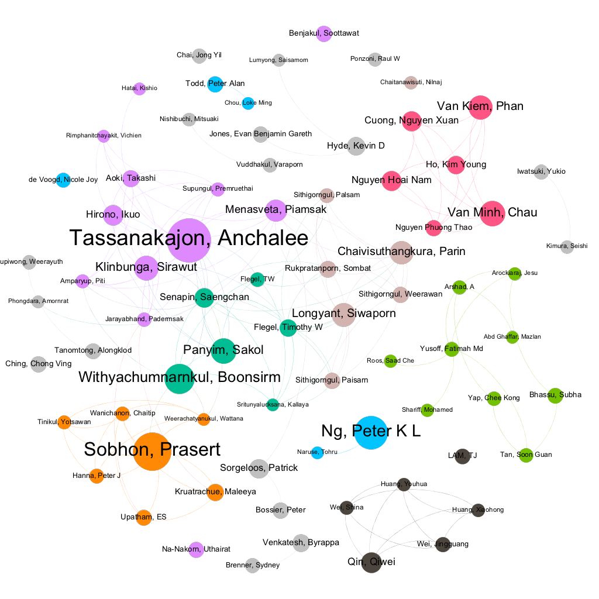

# Scientific Literature {#literature}
\index{scientific literature}

This chapter examines the role of research involving the scientific literature and patent analytics. Analysis of scientific literature is a specialised field in its own right in the form of bibliometrics or scientometrics with its own specialist journals such as Scientometrics and other publications [@An_2018]. These fields cover a wide range of topics involving statistical analysis of scientific literature such as indicators for science and technology, exploration of the impacts of scientific research, research networks, and the mobility of researchers. These field are characterised by a combination of qualitative and quantitative methods and are frequently oriented towards the understanding of trends in science and technology to inform research and innovation policies. The relationship between science and technological innovation is an important focus of research and links analysis of the scientific literature with patent literature. This chapter focuses on the how analysis of the scientific literature can inform patent analytics in there main ways:

a) By informing search strategies
b) By identifying actors who are active inside or outside the scientific literature as part of landscape analysis. 
c) Identifying potential opportunities for economic development to address the needs of developing countries. 

We will begin with a brief overview of ways to access the scientific literature before turning to a discussion of scientific data fields using data from Clarivate Analytics Web of Science as an example. We will then explore how the scientific literature can be used to inform search strategies through the identification of terms from the scientific literature for use in patent searches. We will then look at methods for matching actors from the scientific literature into the patent literature using data from ASEAN countries as an example. Finally, we will look at how comparisons between the scientific literature and the patent literature can assist developing countries with identifying opportunities for economic development to address their needs.

## Accessing the Scientific Literature

The main means for accessing the scientific literature is through databases of scientific literature and increasingly through open access databases using web services of application programming interfaces (APIs).

Researchers based in Universities will generally be familiar with two of the largest of the commercial databases of the scientific literature, Web of Science/Web of Knowledge from Clarivate Analytics or Elsevier's Scopus. Open access databases such as PubMed and Crossref (containing metadata on over 96 million publications) are increasingly popular and link to initiatives such as core.ac.uk that, at the time of writing, make the full texts of over 113 million publications publicly available. Databases such as Google Scholar are a popular open access source of information on the scientific literature and access to copies of texts while social network sites for researchers such as Research Gate provides a means for scholars to share their research and create shared projects. An important feature of recent developments in scientific publication is a shift in emphasis towards open access publications on the part of researchers and funding agencies. This is reflected in services such as core.ac.uk noted above and in services such as Unpaywall which provides a browser plugin to identify open access versions of articles. At present Unpaywall contains links to over 19 million scientific publications. An important aspect of this shift in emphasis towards open access is cross service integration. Thus Unpaywall is based on and resolves article identifiers to the content of Crossref while the commercial Web of Science database provides links to Unpaywall in its results to allow free retrieval of articles. Other important emerging services include tools such as Open Academic Graph which provides access to meta data on over 330 million publications. 

As this makes clear the landscape for accessing scientific literature is changing as a result of the rise of web service enabled database and cross-service integration tools. In practical terms this means that access to the scientific literature is no longer entirely dependent on fee based databases. 

It is important to emphasise that publication databases normally have strengths and weaknesses in terms of: 

a)  Coverage of journals, books and other publications
b)  The languages covered and availability of translations
c)  The range of fields available for analysis (authors, affiliations, titles, abstracts etc.)
d)  The basis of any statistical counts (e.g. counts of citing articles)
e)  The number of records that can be downloaded
f)  The format in which records can be downloaded

These issues impose constraints on what can be searched and downloaded from scientific databases. For example, in our experience Web of Science permits for the downloaded of a wider range of data fields than Scopus, while open access databases enjoy the advantage of being free but are more limited in terms of the data fields that are available and the consistency of coverage, such as abstracts. 

When seeking to carry out literature research as part of a wider patent analytics project it is therefore important to consider the strengths and weaknesses of particular databases and to use multiple sources where necessary.

## Searching Literature Databases

### Stemming

When searching a literature database it is important as a first step to understand the available search fields and search operators (such as OR and AND). Many databases now offer what is called word "stemming" that will look for similar words or phrases based on the root of the terms used during input... for example if we input the word "drone", a stemmed version based on the root "drone" would include words like "drones", "droned" and "droning". In technical terms words like "drones". "droned" and "droning" are lemmas. 

Word stemming is a powerful tool for expanding the range of searches and can be extended to using synonyms. Specialist tools such as WordNet, a lexical database of English words and synonyms, can be used to identify synonyms on a search term [@Fellbaum_2015]. WordNet can be used in a range of programming languages or using the [free online tool](http://wordnetweb.princeton.edu/perl/webwn?s=drone&sub=Search+WordNet&o2=&o0=1&o8=1&o1=1&o7=&o5=&o9=&o6=&o3=&o4=&h=). The results of a search of WordNet for the word Drone are presented below:

>Noun

>- S: (n) drone (stingless male bee in a colony of social bees (especially honeybees) whose sole function is to mate with the queen)
>- S: (n) monotone, drone, droning (an unchanging intonation)
>- S: (n) dawdler, drone, laggard, lagger, trailer, poke (someone who takes more time than necessary; someone who lags behind)
>- S: (n) drone, pilotless aircraft, radio-controlled aircraft (an aircraft without a pilot that is operated by remote control)
>- S: (n) drone, drone pipe, bourdon (a pipe of the bagpipe that is tuned to produce a single continuous tone)

>Verb

>- S: (v) drone (make a monotonous low dull sound) "The harmonium was droning on"
>- S: (v) drone, drone on (talk in a monotonous voice)


```{r eval=FALSE, echo=FALSE}
library(wordnet)
Sys.setenv(WNHOME = "/usr/local/Cellar/wordnet/3.1")
path <- file.path("usr", "share", "dict")
setDict(path)


synonyms("drone", "NOUN")
```

The use of a stemming tool helps to reveal the range of possible uses of a search term. In the case of the word drone we can see references to bees, to sound, to a part of a musical instrument and for pilotless aircraft.

The range of the uses of these terms suggests a need for caution. Thus the use of the term drone in a scientific database is likely to return results on all of these potential uses of the work drone. Stemming algorithms can both aid and hinder information retrieval. For example, if stemming is automatically turned on then the word "droning" would automatically be included and thus populate the results with data on the irrelevant subject of sound for those interested in drone technology. In contrast, where the stemming tool displays synonyms we might wish to include pilotless aircraft in the original search. 

In practice, when initiating a search of a database of the scientific literature on an unfamiliar subject it is generally best to turn off stemming and to focus on downloading a test set of results for review. The aim here is to use a limited set of terms to identify other potentially relevant terms and terms that can be excluded from a sample. 

This approach can be used with a wide range of software tools, including simple tools such as Excel or free online tools. The objective is to take available fields such as the title, abstract, and author keywords and to break them down into their constituent words and phrases. This is a process known as tokenizing text fields into words, phrases (ngrams), sentences and paragraphs of various lengths and is a fundamental feature of computational linguistics, text mining and machine learning **[refs]**. We will look in greater detail at text mining in Chapter \@ref(textmining).

One powerful tool in working with both scientific and patent data is VantagePoint from Search Technology Inc. VantagePoint is available in a student edition and 32 and 64 bit versions for Windows. VantagePoint is able to import a wide range of different data sources and automatically tokenize text fields into words and phrases. 

Table \@ref(tab:table1) below presents the combined top 50 terms in the titles, abstracts, and author keywords from a search of Web of Science for the words drone or drones between 2010 and 2017.

```{r echo=FALSE, eval=FALSE}
save(drones_terms, file = "data/drones_terms.rda", compress = "xz")
```

```{r table1, cache=TRUE, echo=FALSE}
load("data/drones_terms.rda")
knitr::kable(
  head(drones_terms, 20), caption = 'Top Words and Phrases for Drones in Web of Science',
  booktabs = TRUE
)
```

When we inspect the results in Table \@ref(tab:wos_tab) we see a full list of words and phrases. Many of these will not be relevant to drones as such, for example the words article or study and common noisy terms such as "and, or, of, for" are commonly excluded as stop words. In other cases references to the word "queens" or its root "queen" along with "Apis mellifera" and "colonies" suggests that we have a lot of data on bees in the data. In our next iteration of the search we would probably want to explicitly exclude these terms from the search. However we can also detect other works that we might want to include in our search such as "UAV" for Unmanned Aerial Vehicle.  

In practice multi word phrases (ngrams) commonly express concepts (ref Mogatov?) and bring us closer to the terms that we will want to use in a search. Table \@ref(tab:table2) ranks the data based on multi-word phrases. 

```{r table2, echo=FALSE, message=FALSE, cache=TRUE}
library(tidyverse)
load("data/drones_terms.rda")
drones_terms %>% 
  arrange(desc(multi_word)) %>%
  head(20) %>% 
  knitr::kable(caption = "Top Phrases in Web of Science Data on Drones")
```

Table \@ref(tab:table2) reveals irrelevant phrases such as "honey bee" and its plural "honey bees" along with *Varroa destructor*, a mite that parasatises bees. We also observe the prevalence of unmanned aerial vehicles and their plurals linked to the term UAV and applications of drone technology such as "drone warfare" and "drone strikes".

A review of the terms captured in initial exploratory research can thus go a long way to refining a search strategy to improve and focus recall and precision (refs). 

\index{TFIDF}
We have focused here on the top terms in the data. However, in other cases it may be appropriate to review the full list to identify low frequency but highly relevant terms. This type of task can be approached computationally for example by creating a matrix of terms linked to a specific term [example Unmanned Aerial Vehicle] to capture closely related terms. As an alternative the use of the Term Frequency Inverse Document Frequency algorithm (TFIDF). This is an extremely popular calculation that weights terms based on how important they are to the set of documents in the corpus. The key idea behind Inverse Document Frequency comes from Karen Spark Jones in 1972 who proposed that: "...terms should be weighted according to collection frequency, so that matches on less frequent, more specific, terms are of greater value than matches on frequent terms."[@SPARCK_JONES_1972, @Robertson_2004]. In other words using TFIDF high frequency words such as "the" or "and" receive lower weightings than document specific terms such as "unmanned aerial vehicle" that distinguish documents from the wider set. 

The TFIDF algorithm is extremely widely used in information retrieval and is built in to tools such as VantagePoint. 

<!--- insert ILLUSTRATION FROM VANTAGE POINT--->

In practice, the use of matrices to identify nearby words and phrases or TFIDF may not be necessary and will depend on how specific your topic search may be. Other more recent methods such as Word2Vec will be considered in greater detail in Chapter \@ref(textmining)

### Using Search Operators

Many databases include options for operator based searching. The common operators are: OR, AND and NOT. 

this OR that
this AND that
this NOT that

The OR operator is an open operator for example we could search for 

>drone OR drones OR droning

This will locate texts that contain *any* of these terms. If we wanted to restrict the search to those that contain all of the terms we would use AND.

>drone AND drones AND droning

Note that this is a more restrictive form of search because the documents must contain all three words.

In contrast, if we were interested in drone technology and not in other uses of the word drone such as in musical instruments we would use NOT.

>drone OR drones NOT droning

This would only return documents where the search terms drone or droning appeared without the word droning. Another perhaps more precise strategy would be to also exclude music. 

>drone OR drones NOT (bee OR bees OR "Apis mellifera" OR "honey" OR droning OR music)

The parentheses in the above search query are important because they specify that documents containing either be or bees etc. should be excluded from the results. The use of NOT based searching is a powerful way of excluding irrelevant documents. 

Boolean operators are extremely important when constructing search terms and may be expressed in other ways if using databases programaticaly. For example in R both | and || mean OR and & or && means AND. In contrast Python uses logical OR, logical AND, logical NOT. A growing number of databases are powered by the Java based Apache Lucene or Solr. In Lucene and Solr in addition to the standard operators there is also "+" which specifies that a document must contain a term and may contain another term. 

>+drone "unmanned aerial vehicle"

To force both to appear we would use or the regular AND.

>+drone +"unmanned aerial vehicle"

Note that the parentheses in the above version are important because it articulates that one or the other term should be excluded from the results. 

### Proximity Operators

Proximity operators focus on the distance between words in a search term for example the operator NEAR with Web of Science allows the user to specify the distance between words such as `(drone OR drone) NEAR/10 droning` would find texts containing the word drone or drone within 10 words of the word droning. Another option, again from Web of Science is SAME. This is used in searches of the author affiliation field to treat two words as the same during search such as in the address `field AD=(McGill Univ SAME Quebec SAME Canada)`. This search will treat the word Quebec and Canada as the same. 

Proximity operators can provide powerful tools for targeting a search of the scientific literature. However, when preparing to develop your search it is important to check the default settings used by the database and whether that meets your needs. In addition, it is important to note the operators that are available and the form that is expected. These will typically vary across the different databases. For example, many databases turn on stemming by default, use AND (rather than OR) as the default Boolean and may use ADJ (adjacent) as the default operator. Checking these settings at the beginning is important for avoiding confusing results when working across multiple data  

### Regular Expressions

The use of regular expressions will be covered in greater detail in the discussion of text mining. However, it is worth noting that common regular expressions that you may be able to use in a literature databases include

`^` starts with
`*` any character wildcard. For example `dron*` would capture drone, drones, droned, droning etc. This can be used at the beginning, middle or the end of a term but is commonly used at the end. The wildcard should be used with caution. For example, a search for genomics related literature using the root `genom` and the wild card `genom*` will capture a potentially large number of results for the common German word `genommen` (took).
`$` ends with. For example `drone$` would exclude drones and other close terms, however it would capture terms containing drone such as the italian word androne (meaning entrance or entrance hall). As such, beware of unexpected results. 

Regular expressions can be combined in a whole variety of ways. One of the most useful is exact matching.

`^drone$` This will exactly match the word drone and no other term.

Very basic engagement with regular expressions is a powerful tool and it is well worth learning the basics. A good place to start is the long standing [Regular Expressions Tutorial](https://www.regular-expressions.info/tutorial.html). However, be warned that regular expressions can become complex and difficult to understand quite rapidly. A well known quote about regular expressions is attributed to former Netscape Engineer Jamie Zawinski in a Usenet discussion group from 1997. 

>Some people, when confronted with a problem, think “I know, I'll use regular expressions.” Now they have two problems. ^[Jeffrey Friedl Source of the famous “Now you have two problems” quote http://regex.info/blog/2006-09-15/247]

The point that is being made here is that regular expressions should not be the tool of first resort for every problem. Regular expressions can rapidly become very complex and difficult for a reader, including its author, to understand. Having said this a basic understanding of regular expressions is a very important part of the patent analysts toolbox as it allows you to precisely control what you are searching for and to parse the results. Tokenization of texts discussed above is an example of this that is typically based on word boundary matches (such as `\\b`) while named entity recognition in texts is often based on the identification of capitalized terms such as `^[[:upper]]` or the equivalent `^[A-Z]` to identify proper nouns (which are marked by the use of capital letters at the start of the word) such as people, place and other entity names. The precise form of a regular expression often depends on the language being used with Open Refine's GREL or Google Regular Expression Language providing a nice practical introduction to using regular expressions as discussed in Chapter 8 of the [WIPO Manual on Open Source Patent Analytics](https://wipo-analytics.github.io/open-refine.html). Programming languages such as R include speciality packages such as `stringr` that make it easier to work with regular expressions and cheatsheets have been developed to assist in remembering regular expressions.^[ See for example the `Basic Regular Expressions in R` Cheatsheet by Ian Kopacka available from RStudio].  Websites such as the Regular Expressions Tutorial and [https://regex101.com/](https://regex101.com/) allow you to test out regular expressions in a range of different programmming languages. 

## Precision vs. Recall

At the end of the testing phase with scientific literature a set of new candidate terms and exclusion terms is the desirable outcome. For example, a more refined approach to the development of a search query for drone technology might look something like this. 

>"drone" OR "drones" OR "UAV" OR "UAVs" OR "Unmanned Aerial Vehicle" OR "Unmanned Aerial Vehicles" OR "Pilotless Aircraft" NOT ("bee" OR "bees" OR "Apis mellifera" OR "honey" OR "droning" OR "music") 

The use of the quotation marks in this case is intended to prevent the database from stemming the individual terms and the effect is to increase the level of precision in the inclusion and exclusion of terms. While it would be possible to modify this in a variety of ways using the wildcard or boundary markers, the importance of this type of approach is that it is simple, transparent, easy to reproduce and easy to modify in a way that can be tested. 

The discussion above is linked to a much larger body of literature on the distinction between Precision and Recall in information theory *[refs]*. For a literature database an example of this would be entering in a set of terms where the database returns 30 pages on drones that carry pizza boxes of which only 20 are relevant but fails to return the other 40 relevant documents. That is a precision rate of 20/30 = 2/3 as only 2 thirds of the returned documents are on topic. In contrast the recall rate is 20/60 or 1/3 because the database only returnd a third of the actual relevant documents.^[This example is adapted from the Wikipedia entry at https://en.wikipedia.org/wiki/Precision_and_recall] The first measure is about the accuracy of the results and the second is about the completeness of the results. 

In practice precision vs recall is aboout striking a good balance between accurracy (precision) and recall (completeness). One strategy for dealing with this is to start by favouring completeness by attempting to capture the universe of things relating to a topic and then filtering the data to arrive at more precise results to address the topic in question. 

In the next section we will use examples from the Scientific and Patent Landscape for Marine Genetic Resources that used exactly this strategy. The starting point for the research was to capture all scientific publications that contained an author from one of the ten South East Asian Countries or that contained a reference to the country in the title, abstract or author keywords of a publication. This approach captured the universe of things that needed to be captured. That universe proved to be 391,380 publications after filtering some of the larger country datasets on subject categories to reduce irrelevant subject areas. The aim here was to capture the universe of things that could potentially contain a marine species or genetic resouces. The second stage of this exercise involved text mining the titles, abstracts and author keywords for marine species names. This radically reduced the dataset to 6,659 scientific publications. As this makes clear, the use of this method can be costly in terms of the requirements of initial data retrieval but has the advantage of capturing the universe of relevant documents. On that basis the marine species in the data could be accurately targeted. 

One very significant constraint when working with the scientific literature as opposed to patent data is that it is very rare that the full text of a scientific article is available for search. This has a major but not readily quantifiable impact on recall because the major body of the text is o


Debates around precision and recall and related concepts such as relevance are important across a wide range of computer and information retrieval fields including, for example, text and image classification in machine learning approaches discussed above. As regular users of search engines, patent analysts like other regular users will encounter the outcomes of decisions about how to handle the balance between precision and recall with varying degress of success in presenting useful results to the searcher. We will return to this topic in the discussion of machine learning. 

## Processing Scientific Literature

Databases of the scientific literature commonly return a range of different fields when data is downloaded. These can vary widely but will commonly include most of the following:

- Author Name
- Author affiliation
- Title
- Abstract
- Author Keywords
- Document Identifier (e.g. doi, issn, isbn)
- Funding Acknowledgements (limited coverage)
- Cited references
- Citation counts
- Subject category (derived)
- Researcher identifier (ORCID, Researcher ID, PubMed Id, other ID)


This data is mainly extracted from the front page of publication or, in the case of references, the end of the document. However the subject category is commonly added by the publication database itself and is commonly based on the classification of the subject area(s) of journals rather than individual articles. At the time of writing Web of Science used 252 Subject Categories and Scopus groups journals into 4 broad subject areas and 334 fields.^[[Scopus subjects]( https://service.elsevier.com/app/answers/detail/a_id/15181/supporthub/scopus/related/1/session/L2F2LzEvdGltZS8xNTMzODE0NzYzL2dlbi8xNTMzODE0NzYzL3NpZC9mVXRPUTg2NVR0WEJ2SWp6cnFyZFZ1U2J2UFdiUE5GWEQ0VjhQWnpKVjVEektvRjVHOWNtbHBodGRha2pBb2lFbF9FclBrSGJzNHc4NnclN0VKV3ZlRTJRQTc3V2ZITUdSSXJpYzQwR2R0NHpTMlliVU5xYmQ0SGppdyUyMSUyMQ%3D%3D/), [Web of Science subjects](https://images.webofknowledge.com/images/help/WOS/hp_subject_category_terms_tasca.html)]. A journal may be classified in more than one subject area with some such as Science, Nature and PLOS classified as interdisciplinary. The use of subject categories combined with citation analysis has been central to initiatives in the scientometrics community to develop maps of science [@Leydesdorff_2009, @Klavans_2009, @Rafols_2010 and for an alternative web click based approach see, @Bollen_2009] including online interactive maps such as the [https://www.scimagojr.com/shapeofscience/](https://www.scimagojr.com/shapeofscience/) using Scopus data with a gallery of maps on the structure of science from a range of sources made available through the [http://scimaps.org/](http://scimaps.org/).

The processing of scientific literature follows a pattern that is very similar to patent data as discussed in Chapter \@ref(patents). These steps can be described as follows:

1.  Deduplicate the records using document identifiers (such as Web of Science ISI Unique Identifier or equivalent) to ensure that no records is over counted.
2.  Review the dataset for noise and exclude noise as required. 
2.  Clean author names
3.  Clean affiliation/organisation names
4.  Clean funding information to focus on funding organisations
5.  Visualise the data


The deduplication of the data is important to avoid overcounting and can readily be achieved using document identifiers. Note that the best source for this is often the internal identifiers used by the databases as they are guaranteed to have 100% coverage unlike the doi field (normally confined to journal articles).

The exclusion of noise from the dataset will commonly involve reviewing the data by subject category. Table \@ref(tab:table3) below displays the top subject categories in a sample of 1400 publications for the term drone or drones from Web of Science.

```{r table3, echo = FALSE, message=FALSE}
library(readxl)
library(tidyverse)
#wos_subject <- read_excel("~/Desktop/wos_drones_subjectsexample.xlsx")
#save(wos_subject, file = "data/wos_subject.rda", compress = "xz")
load("data/wos_subject.rda")
knitr::kable(wos_subject, caption = "Top Web of Science Subject Categories for Drones Sample Data")
```

Here we can see that we have a significant number of publcations in Entomology, and Zoology that are highly likely to be about bees rather than drone technology. When using VantagePoint \index{scientific literature::VantagePoint} it is easy to create groups such as keep, review and exclude that record decisions on data to include or exclude as a basis for refining a dataset. The review category is important because journal subject categories are somewhat crude. For example, Multidisciplinary sciences will include publications on drone technology and on bees. Agriculture related subjects are also a likely review category because bees and drone technology may appear in this category, for example for monitoring fields. The purpose of the review group is to allow time to view the records in particular categories with the aim of allocating all records to either keep or exclude at the end of this process. 

The use of subject categories is often a first place to look with either very high frequency or low frequency subject categories as good candidates for noise. However, a complementary second step is to look at the sources of the publications. A sample of this data for drone technology from Web of Science is presented in Table \@ref(tab:table4).

```{r table4, echo=FALSE, message=FALSE}
library(readxl)
library(tidyverse)
#wos_source <- read_excel("~/Desktop/wos_drones_stop_journals.xlsx")
#save(wos_source, file = "data/wos_source.rda", compress = "xz")
load("data/wos_source.rda")
wos_source %>% 
  knitr::kable(caption = "Top Web of Science Sources for Drones Sample Data")
```


In this case we can see that publications such as Apidologie can readily be excluded where as journals such as PLOS ONE that publish across a range of fields would require review. We can also see that a number of social science and humanities subjects are entering into the picture and depending on our purpose we might want to focus publications down to those relating to remote sensing, engineering and related subjects.

As part of this review process it is important not to second guess the technology area. For example, we should not assume that everything associated with biology should be excluded. Biomimicry is for example an important area of inspiration in some areas of drone technology (such as swarming behaviour) while some publications that refer to drones and biology refer to the use of drone technology in anti-poaching and conservation biology. It is precisely because of the _lack of predictability_ of new and emerging areas of technology that an approach concentrating initially on recall and then on precision is often the most succesful route to accurate analytics. The alternative is for analyts to impose a definition of a new technology area on the field of research and thus potentially exclude important features of the technology field and debates around those fields (such as military drone strikes).

The outcome of this review process is that each record falls into a keep or exclude category and a smaller dataset is generated containing the data the analyst wishes to keep. At this stage the main body of data cleaning focusing on author organisations (in the author affiliation) and author names along with the text in funding acknowledgements can begin. 

The basic procedure for name cleaning has been described in Chapter 8 of the [WIPO Manual on Open Source Patent Analytics](https://wipo-analytics.github.io/open-refine.html) using the free Open Refine software tool. However, accuracy in name cleaning is best achieved using multiple match criteria to address cases where an author shares a name with another author but is a distinct person. VantagePoint provides a means to achieve this by linking a fuzzy logic name cleaning algorithm that clusters names based on similarity scores with a setting that allows another field to be used to match the data. That is a search for John Smith that is run without match criteria will group different John Smiths together. A clean up that is run by grouping John Smiths using the author affiliation will distinguish between John Smiths working at say the University of California or John Smiths working at London University. As this example also suggests name cleaning is often a multi-step process because in reality multiple John Smiths may work at the University of California. In that case a second step might be to use shared coauthors or subject categories as a basis for decision making using the `keep, review, exclude` method described above. The same approach is then applied to the applicant organisation where particular attention is required to organisations that share similar names but are distinct entities. Thus Washington University and the University of Washington are distinct entities. When cleaning organisation names note that decisions need to be made on how to address regional and international organisations and to provide notes in the resulting report or publication on decision-making to inform the reader. 

In considering the clean up process for author names described above not that it is often easier to begin by cleaning up the author affiliation names and then to clean author names using the cleaned organisation names as the match criteria. 

An important development in recent years has been the increasing use of author identifiers in publication records. A number of author identifier systems exist such as Researcher ID from Web of Science or Scopus ID and PubMed ID but the most important of these is ORCID which is a non-profit open access researcher identifier system. Where a researcher identifier is available these identifiers can be used to cluster variations of names with a degree of certainty that they are the same person or that persons with the same name with distinct ORCID IDs will in fact be distinct persons. At a higher level of detail ORCID ID public profiles can be looked up online to assist with assessing whether a researcher listed as belonging to one institution has moved to another. Cases of author movement will frequently involve a research working in the same area of research but listing more than one affiliation. ORCID identifiers help to resolve these cases. 

Funding data is a relatively new feature in publication databases and the presence of this data, which commonly appears in the Acknowledgements field can be spectacularly messy. For example:

>The COLOSS (Prevention of honey bee COlony LOSSes) network aims to explain and prevent massive honey bee colony losses. It was funded through the COST Action FA0803. COST (European Cooperation in Science and Technology) is a unique means for European researchers to jointly develop their own ideas and new initiatives across all scientific disciplines through trans-European networking of nationally funded research activities. Based on a pan-European intergovernmental framework for cooperation in science and technology, COST has contributed since its creation more than 40 years ago to closing the gap between science, policy makers and society throughout Europe and beyond. COST is supported by the EU Seventh Framework Programme for research, technological development and demonstration activities (Official Journal L 412, 30 December 2006). The European Science Foundation as implementing agent of COST provides the COST Office through an EC Grant Agreement. The Council of the European Union provides the COST Secretariat. The COLOSS network is now supported by the Ricola Foundation - Nature & Culture.

Literature databases are attempting to parse relevant information from this data such as the name of the funder and the contract or award number with varying degrees of success as follows:

>COST Action, FA0803 | EU Seventh Framework Programme, - | Ricola Foundation - Nature Culture, -

In considering the discussion of regular expressions above note the focus in the parsing of this data on Nouns and Proper Nouns and numeric entries although it is likely that dictionary based approaches and machine learning based funding entity recognition are under development. 

An important challenge when dealing with funding information is determining whether data should be grouped or not. For example should funding from the European Commission under the Framework programmes and those under European regional or sectoral funds be grouped together. The answer to this question will depend in part on the level of detail required by the research. In general the approach taken, such as grouping all EU level funding together, should be made clear in an explanatory note to the reader when presenting the results of the data. 

One important observation on cleaning data is to consider how detailed the cleaning operation needs to be. For example, if only the top ten or top 20 results will be shown to the reader it is important to ensure that person, organisation or funding organisation have been cleaned to capture all relevant name variants to ensure the accuracy of counts. 

## Visualizing the Scientific Literature

A wide range of options are available for visualising data from the scientific literature. Typically this will include basic data on trends, geographic distribution of records, subject areas, top ranking organisations and researchers. When working to visualize data it is a very good idea to become familiar with some of the excellent literature on this topic notably the classic book _The Visual Display of Quantitative Information_ by Edward Tufte and Stephen Few (2012) _Show Me the Numbers: Designing Tables and Graphs to Englighten_.

To illustrate some approaches to visualising data from the scientific literature we will use data from the WIPO report on  marine genetic resources in South East Asian countries. 

### Dashboards
\index{scientific literature!Dashboards}
Dashboards are a powerful and popular way of summarising data. Figure \@ref(fig:foo) shows a summary of the overall data on scientific research on marine genetic resources in South East Asia. 

```{r foo, fig.align='center', echo=FALSE, out.width='100%', fig.cap="Overview of Research on Marine Genetic Resources in ASEAN Countries"}
knitr::include_graphics("images/aseanmarinlit_overview.png")
```

Figure \@ref(fig:fig2) displays details of the species, subject areas, organisations and authors.


```{r fig2, fig.align='center', out.width='100%', echo=FALSE, fig.cap="Overview of Marine Species, Organisations and Authors"}
knitr::include_graphics("images/aseanmarinlit_species_overview.png")
```

The effect of the use of dashboards is to convey the principle factual information in an easily digestible form. As readers will commonly scan from left to right, the first panel should contain the key information that you wish to convey. In the first case above the aim of the first panel is to draw attention to the fact that the data is from South East Asia. In the second panel the aim is to draw attention to the marine species as the key to interpreting what the data is about. Note that attention may be required to issues such as the size of fonts and the number of panels in communicating results to the reader. 

The visualisations above were created using Tableau and a practical guide to creating dashboards is provided in Chapter 9 of the WIPO Manual on Open Source Patent Analytics using the free Tableau Public software.

One issue with visualisations of data in this way is that they are vertical. We do not see the relationships between entities in the data when in practice scientific research is commonly conducted as part of networks of collaboration on different levels. Network visualisations address this problem

### Network Visualisation
\index{scientific literature!Network visualisation}

Figure \@ref(fig:fig3) displays a network view of the relationships between authors involved in scientific research on marine genetic resources in South East Asia. The dots are sized based on the number of publications associated with an author. The lines or edges represent co-authored publications. The network has been limited to display authors with 20 or more publications.

```{r fig3, fig.align='center', echo=FALSE, out.width='100%', fig.cap="Research Networks for researchers with 20 or more publications on marine genetic resources"}

```


These network images arfe important because they display relationships that are difficult to see in any other way. A particularly good example of this is networks of funding organisations as set out in Figure \@ref(fig:fig4). Note that in Figure \@ref(fig:fig4) the size of the dots represents the number of publications where the funding agency appears in the acknowledgements ad does not reflect the size of financial investments. The lines represent publications where different funding agencies appear in the acknowledgements.

```{r fig4, fig.align='center', echo=FALSE, out.width='100%', fig.cap="Network of Funding Organisations Supporting Research on Marine Genetic Resources"}
knitr::include_graphics("images/aseanmarinlit_fundingnetwork.png")
```

The full extent of network relationships is typically invisible to network participants. This is particularly true for networks of funding organisations. However, network visualisation is a powerful tool for engagement with researchers and audiences interested in a particular subject. The network visualisations presented above were created using the free Gephi software and a practical guide to creating these networks is provided in Chapter 10 of the [WIPO Manual on Open Source Patent Analytics](https://wipo-analytics.github.io/gephi-1.html).

### Other forms of visualisation
\index{scientific literature!Sankey diagrams}
Data visualisation has advanced rapidly in recent years and the D3 Javascript library has been responsible for a virtual explosion in creativity with interactive graphics. Examples of visualisation possibilites can be viewed in the D3 gallery on Github [https://github.com/d3/d3/wiki/Gallery](https://github.com/d3/d3/wiki/Gallery). One among other possibly fruitful options for data visualization is the Sankey diagram a form of dendogram that aims to display the flow of energy between entities. Figure \@ref(fig:sankey) displays the flow of research publications on a marine species in South East Asia into journals by subject area.

```{r sankey, echo=FALSE, fig.align='center', out.width='120%', fig.cap="A Sankey Diagram showing flows of research on marine genera into journals by subject areas"}
library(networkD3)
library(tidyverse)
library(readxl)
# import file
#species_subject <- read_excel("data/sankey_species_subject.xlsx")
#save(species_subject, file = "data/species_subject.rda")
load("data/species_subject.rda")
# limit to genus
genus <- species_subject
genus <- genus %>% separate(source, c("genus", "taxa"), sep = " ")
genus <- genus %>% select(-taxa)

# aggregate on the genus and target to remove duplicates

genus1 <- genus %>% group_by(genus, target) %>%
  tally(value) %>% 
  arrange(desc(n)) %>% 
  rename(value = n, source = genus)

# prepare data by removing the diagonal (should not be present in this dataset)
genus_test <- genus1[1:60,] %>% 
  select(source, target, value) %>%
  reshape2::dcast(source~target)
genus_test[is.na(genus_test)] <- 0 # convert NAs to zero
rownames(genus_test) <- genus_test[,1] # source to rowname to avoid overwriting
genus_test <- genus_test %>% select(-source) # drop the source
diag(genus_test) <- 0 # now remove the diagonal
#test <- rownames_to_column(test) # add source back in

# Transform it to connection data frame with tidyr from the tidyverse:
links = genus_test %>% 
  as.data.frame() %>% 
  rownames_to_column(var="source") %>% 
  gather(key="target", value="value", -1) %>%
  filter(value != 0) # keep only values over 0

# Create a node data frame for every entity involved in the flow

nodes=data.frame(name=c(as.character(links$source), as.character(links$target)) %>% unique())

links$IDsource=match(links$source, nodes$name)-1 
links$IDtarget=match(links$target, nodes$name)-1
 
# Make the Network
sankeyNetwork(Links = links, Nodes = nodes,
                     Source = "IDsource", Target = "IDtarget",
                     Value = "value", NodeID = "name", 
                     sinksRight=FALSE, fontSize = 12, fontFamily = "Arial")
```

This type of visualisation serves the useful purpose of showing the flow of research effort represented by publications as outputs into different subject areas. A particular strength of this visualisation is that we can see the proportion of research on a particular genus of marine organisms such as prawns in the genus Penaeus such as the Giant Tiger Prawn into journals on particular subjects. For Penaeus, a major focus of aquaculture in South East Asia, we can see that the flow of research energy is channeled towards fisheries, marine and freshwater biology and Veterinary Sciences (to address diseases with an effect on this commercially important genus such as viruses in the genus Vibrio). When viewed online this diagram is interactive and will highlight flows from a particular genus to a subject area.

The ability to create Sankey diagrams depends in a large measure on a willingness to engage with a programming language such as Javascript, R or Python that provide libraries to make the calculations and generate the Javascript digrams. Thus the diagram above was generated with the D3network package in R. However, a number of online services offer the ability to create Sankey diagrams and these may meet your needs.  

## Linking the Scientific Literature with Patent Analysis

Analysis of the scientific literature is important because it allows us to understand the landscape of research for a particular topic. In the case of drone technology we saw that exploratory searches could assist in identifying key words for the construction of more refined search strategies and to progressively exclude noise from the results. In the data we have presented above on research on marine genetic resources in South East Asia we processed the data to answer the following fundamental questions:

1.  Who (and with whom?)
2.  What
3.  Where
4.  When
5.  How

These are standard questions in empirical research. The final question requires detailed attention to the literature itself in terms of understanding the precise subject matter of research by a particular individual or a research team. However, this type of landscape analysis allows us to investigate whether research has the potential to be transformed into a commercial product, method or process and therefore brings us to the patent and wider intellectual property system.  

This type of research can be useful on a range of different levels:

a)  universities may be interested in identifying research outputs that may have potential to turn into useful products, methods or processes
b)  companies active in particular sectors may be seeking to develop new products and are seeking to identify relevant existing research
c)  Funding agencies may be seeking to understand the existing outcomes of research investments and to identify relevant areas of priority research that promise to result in new and useful products. 

In many cases analysis of the scientific landscape will take place at a lower level than the ten countries covered by the research on South East Asian countries covered above. However, this example illustrates the possibility of using these methods and approaches to answer empirical questions at scale and then to drill down into the fine grained detail of research. 

One major question that arises here is how to link together research on the scientific literature with research in the patent system. There are two main answers to this. 

a)   To use keywords and phrases identified in research from the scientific literature as the basis for searches of the patent literature. 

This is likely to be the most common approach. As discussed above access to sections of the literature such as titles, abstracts and author keywords allows for the application of basic text mining approaches to breaking texts into words and phrases. This in turn allows for the literature to be classified and refined to identify targets of interest. In software such as VantagePoint this is commonly done by sorting the data into groups. For example, in the case of drone technology one important area of research focuses on sensors while another separate area of research focuses on wireless devices to supply power to a drone while a third focuses on devices such as headsets and other devices for controlling a drone in flight.

b) To focus on identifying individual researchers who are active in a research field who are also active in the patent system

This approach to linking scientific research with patent data is rarer for the straightforward reason that it is much harder to do at scale than an approach using keywords. However, it has the advantage of providing a clearer view of researchers who are already active in commercial research and development with a high degree of precision. 

### Mapping Authors to Inventors

The identifying researchers who are active in the patent system involves a three step process

1.  Joining a dataset with the scientific literature to a patent dataset and combining the inventor and author name fields.
2.  Identifying match criteria to establish whether an author and inventor are the same person
3.  Applying the match criteria to arrive at a dataset that includes authors who are also inventors
4.  Reviewing and summarising the data. 

The first step in the process involves identifying the appropriate approach to creating a patent dataset. This could involve the use of a broad set of terms to capture the likely universe of patent activity using the scientific literature as a guide to term selection. For example, in the case of drone technology it would be logical to create a working dataset using terms discussed above such as drone and unmanned aerial vehicle. The primary issue here is spreading the net wide enough to capture the universe of activity while narrowing the data sufficiently to avoid using a vast dataset. 

For research on national level activity, such as in the case of the landscape for research on marine genetic resources in South East Asia the approach taken was to identify patent activity from the national collections and patent activity worldwide linked to a South East Asian inventor or applicant followed by text mining the data for marine species and treating that data as the working dataset. This approach required access to patent data at scale and the ability to process that data (performed in VantagePoint and R).

VantagePoint is an important tool for joining datasets of different types and creating a common field. Thus, in the research on South East Asia the scientific data and patent data were combined into one dataset \index{VantagePoint}. In the next step the authors full name field and the inventor name field were combined together. In both cases the names had previously been cleaned. In the case of the scientific literature there were a total of 17,625 names and in the case of the patent data there were 9,832 names.

The next step in the approach is the use of match criteria. In this case the following criteria were used. 

1. An author and a co-author appeared as inventors in the same patent document
2. The name of an author and the organisation listed as the applicant matched with the author affiliation.
3. An author name matched with an inventor name and the marine species name appeared in both the scientific publication and a patent document

The purpose of these criteria is to identify author-inventors and it is important to note that the third match criteria can vary from dataset to dataset. The important point is to identify and use match criteria. In order to qualify as an author inventor the record was required to meet at least one and preferably two of the criteria above. Experience has revealed that the names of co-authors who appear as inventors is the most accurate match criteria. One exception to this is East Asian names where, in accordance with traditional naming practices, the names of co-authors and inventors may be very common. This can result in false positive matches and it is therefore important to isolate such cases to test against the other match criteria. 

As discussed above, one useful method for working with large amounts of data is to allocate records to keep, review and exclude groups and adopt a method of multiple passes. At the end of the first pass the review group will typically be large because it marks up those cases where there was an element of uncertainty on the match criteria. For example, where the author and co author names appear to match with inventors but are very common names. Alternatively, the first criteria might have been met but the affiliation and organisation records did not match. Finally, for review include instances where there is an author to inventor match but only the species names are shared. During the second and potentially multiple other passes, the review group is progressively allocated to either keep or exclude. While the same method can be used with programming languages VantagePoint is designed to facilitate this type of close work and has the advantage that other data fields can be reviewed for matching as the cleaning process proceeds. 

<!---Insert vantage point screen shot to illustrate--->

At the end of the process a total of 290 authors of research on marine genetic resources in South East Asia who are also inventors were identified. As this suggests, developing this type of analysis involves reviewing a large number of records with the expectation of a low number of results. A particular advantage of the use of match criteria is that it limits the high probility of false positive matches if match criteria are not used. 

As this also suggests mapping researchers from the scientific literature into the patent literature can be very time consuming. This is a particular problem when research is on a large scale such as the level of millions of records. The problem of name disambiguation and corresponding challenges with name cleaning have proved to be a persistent challenge in both the scientific literature and in the patent literature. However, there are signs that the situation may be at least improving even if it is not solved. 

In the case of the scientific literature the growing us of free ORCID identifiers promises to help improve but not solve the challenge of name disambiguation. At the time of writing over 5 million ORCID identifiers have been issued and an increasing number of funding organisations and publishers are either requiring or requesting an ORCID identifier. Clarivate Analytics has also made the relationship between its longstanding Researcher ID system and ORCID seamless. In an innovative move the Lens Patent Database now encourages researcher-inventors to associate their ORCID. In addition, the Lens has linked over 10 million non-patent literature citations to ORCID records so that researchers can see patent literature that cites their research. This suggests that ORCID identifiers may potentially have an important role to play in name disambiguation across the scientific and patent literature if uptake by researchers continues to increase rapidly. 

In a separate development in 2015 the USPTO hosted an Inventor Disambiguation Workshop to discuss the problem of inventor name disambiguation.^[The workshop livestream archive is available at https://livestream.com/uspto/PatentsViewInventorWorkshop] As a result of a competition held by the USPTO a team from the University of Massachusetts Amherst led by Andrew McCallum and Nicholas Monath developed an algorithm using discriminative hierarchical coreference or in essence a decision tree model for clustering inventor names based on coreferences to other data fields in the record [for a detailed description of the approach see @Wick_2012]. The outcome of this research was applied both the the USPTO inventor and assignee field and the creation of new tables with links to the original raw tables. While it is not expected to be error free the PatentsView data tables may offer opportunities to more easily establish linkages between data from the scientific literature and patent data, at least for USPTO data because it is freely available and has been pre-processed.

The ability to match names between the scientific literature and patent literature at scale remains as a significant and time consuming challenge. However, in the case of ASEAN countries it revealed author-inventors such as Baldomera Olivera from the Philippines who pioneered research on cone snail toxins that would feature on the front page of Science magazine and lead to an approved pharmaceutical. Other researchers identified through this approach included husband and wife team Hu Bow and Ding Jeak Ling from the National University of Singapore who identified a recombinant cDNA factor from the Horseshoe Crab that is now used in endotoxin assays and biosensors. In short, the approach yields detailed evidence of researchers who have succesfully licensed inventions that have become products on the market. 

In practice, the majority of research activity does not result in patent activity. However, combining analysis of the scientific literature with the patent literature can lead to the identification of potential candidates to be taken forward for development and examples of successful licensing of research and inventions that can serve as positive examples for researchers and policy makers elsewhere.

We will close this discussion of methods and approaches for linking analysis of scientific and patent literature with a recent development to link literature citations and patent data. 

## Linking Citations with Patent Literature 
\index{scientific literature!Lens scholar}

An alternative way to think about the relationship between the scientific literature and patent activity is to focus on non-patent literature citations [@Callaert2006]. In a recent development the open access Lens patent database has done extensive work to link document identifiers in the non-patent literature to the Crossref database of metadata on over 96 million publications and to link records with PubMed and Microsoft Academic. The effect is to create a bridge based on identifiers between the scientific and the patent literature. Figure \@ref(fig:lensbib)


```{r lensbib, echo=FALSE, fig.align='center', out.width='100%', fig.cap="Literature Citations Linking to Patent Citations and to external data sources in the Lens"}
knitr::include_graphics("images/lens_scholar.png")
```

This figure shows the top ranking literature citation across the data for the well known Basic Local Alignment Search Tool or BLAST that is widely used in fields such as genomics. Each entry links to a summary table include Medical Subject Headings (MeSH) terms where appropriate and a Citations page that will reveal Patent citations and Literature citations. Registered users, registration is free, can store and then export the results. Table \@ref(tab:synbio) presents a sample of fields from the top 5 of the 9000 exported results from a search of Lens Scholar for "synthetic biology".

```{r synbio, echo=FALSE, fig.align='center'}
library(tidyverse)
#lens_scholar <- read_csv("data/synbio-scholar.csv")
#lens_scholar <- lens_scholar %>% arrange(desc(`Referenced by Patent Count`))
#save(lens_scholar, file = "data/lens_scholar.rda", compress = "xz")
load("data/lens_scholar.rda")
lens_scholar <- lens_scholar %>% select(Title, `Referenced by Patent Count`, `Publication Year`, `Citation IDs`, `Author/s`)
  knitr::kable(
  head(lens_scholar, 5), caption = 'Lens Scholar Exported Results for Synthetic Biology',
  booktabs = TRUE
)
```


As this suggests, growing trends towards the federation of the scientific and patent literature present important opportunities for designing search strategies and more flexible approaches to the analysis and communication of results building on both the scientific and the patent literature. 

## Conclusion

This chapter has focus on methods for working with data from the scientific literature, using analysis of the scientific literature to build up a search strategy, the development of a scientific landscape study and methods for linking scientific literature to patent analytics. 

