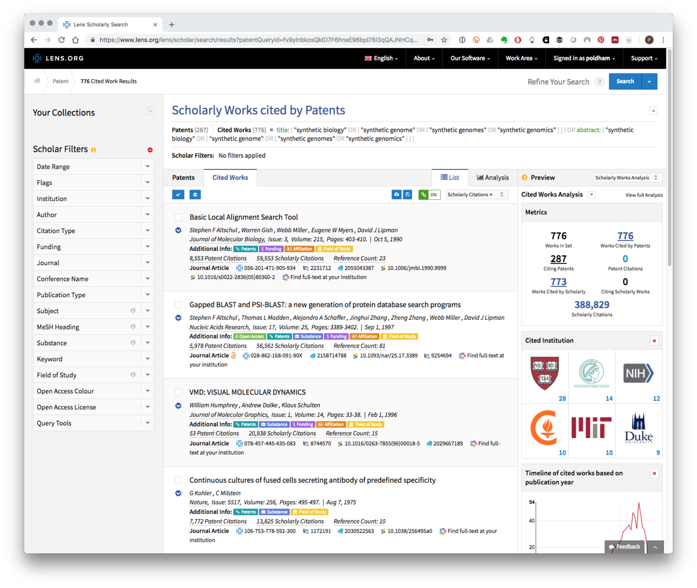
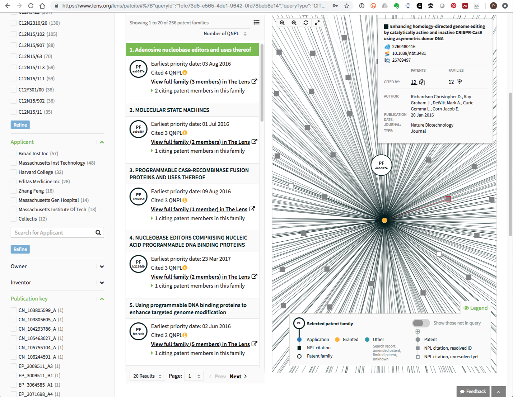

# Patent Citations {#citations}
\index{citations}
<!--- last spell checked 2022-08-18--->
This chapter focuses on the use of patent citations in patent analytics. Patent citations take two main forms:

a) Citations of the scientific literature and other material such as news articles and websites, known as the Non-Patent Literature or NPL
b) Citations of patent documents. 

The patent citation system is similar to the familiar academic citation system. However, patent citations differ from academic citations because they *limit the scope* of what an applicant can claim to be new or novel or as involving an inventive step. As the American economist Suzanne Scotchmer reminds us when approaching the patent system applicants are 'standing on the shoulders of giants' [@Scotchmer_1991]. Put simply new applicants are confronted by the combined weight of the scientific literature, other material and existing patent applications that make up the _prior art_. The prior art limits the scope of what may be claimed by new applicants and is recorded in patent citations.  

Citations within the patent system have become an important focus for research in fields such as econometrics, scientometrics and innovation studies. Citations of the non-patent literature are important focus of research because they help to reveal the closeness of the relationship between scientific research and innovative activity reflected in the patent system. Citations of patent documents are a focus of research because the number of citations that a patent document or patent family attracts is an indicator of social and economic value [@Jaffe_2017]. In addition, analysis of patent citations can lead to the identification of similar patent documents in a technology field, technology spillovers and technology trajectories. 

A rich literature has emerged around patent citation analysis and we will highlight some of the key sources in the course of this chapter. Recent work by @Jaffe_2017 provides an accessible and detailed overview of social scientific research involving patent citations. For those seeking to ground themselves in key literature the work by Adam Jaffe and Manuel Trajtenberg [@Jaffe_1998; @Jaffe_2002], along with work by Bronwyn Hall [@Hall_2001; @Hall_2005; @Hall_2012], Colin Webb and Helene Dernis at the OECD [@Webb_2005] and Dietmar Harhoff [@Harhoff_1999; @Harhoff_2003] are essential reading. For those interested in exploring the wider literature on patent citations a [Lens public collection](https://www.lens.org/lens/search/scholar/list?collectionId=203349) is available to assist readers with getting started. The [collection](https://www.lens.org/lens/search/scholar/list?collectionId=203349) is dynamic and will automatically update to the latest literature on patent citations. 

In this chapter we will begin with the non-patent literature and move step by step through the issues that need to be considered when working with patent citation data. We will use examples from synthetic biology and CRISPR genome editing technology to illustrate approaches to the non-patent literature and patent citations and finish with recent research on identifying technology paths with citation data. 

### Non Patent Literature

Non-patent literature mainly takes the form of scientific publications such as journals, books, or chapters but also extends to other types of materials such as manuals, news reports, drawings and websites. As we will see below, viewed from a data science perspective the non-patent literature is that it generally takes the form of messy free text that requires extensive cleaning. However, from approximately 1980 onwards NPL has become an increasingly important focus for research. 

For those seeking to track the emergence of research on NPL citations we will simply provide some useful way points. An important starting point of research on non patent literature is work by @Carpenter_1980 on the links between basic academic research and patent activity using US patent citation data. This was followed in the mid-1990s by more detailed studies with larger scale data by Narin and collaborators [@Narin_1995; @Narin_1997]. This was accompanied by the growing proliferation of technology specific studies using citations such as work by @Meyer_2000 on the relationship between nanoscale technologies and the cited literature. Citation based studies have tended to be heavily focused, for reasons of accessibility, on US patent data. However, in the mid-2000s work by @Callaert_2006 examined 10,000 citations from the US and the European Patent Offices. This was followed by work to address the significant problems that exist with noise in NPL data using machine learning models [@Callaert_2011]. The growing availability of NPL citation data is reflected in the growth of national and sectoral studies such as work by @Fukuzawa_2015 exploring the links between scientific articles and patents for leading researchers in Japan. Recent work by @Ding_2017 has focused on the characteristics of scientific articles that facilitate knowledge flows between science and technology while @Chen_2017 has explored the textual similarities between scientific articles and the contents of patent applications. Research by @Rizzo_2018 has focused on the closeness of publicly funded research and radical inventions in UK filings at the European Patent Office. 

As this very brief set of way markers suggests, a significant body of work on diverse topics has emerged around the non-patent literature. While much of the original research focused on US patent data the creation of the EPO World Patent Statistical Database (PATSTAT) has made the wider non-patent literature available in a single table and served as a spur for research [@Webb_2005; @Callaert_2011; @Karvonen_2013]. The recent PatentsView service from the USPTO now makes NPL citations available as a single table containing over 6 million raw references that can be freely downloaded. As such, data on non-patent literature citations is becoming more and more accessible for research. 

We will consider the case of PatentsView in more detail below. However, one of the most important recent development are efforts by patent databases, led by the [open access Lens database](https://www.lens.org/) to electronically link literature databases and patent databases together. 

### Literature and Patent Citation Data with the Lens

As discussed in the chapter on the scientific literature, free electronic access to sources of the scientific literature is increasingly available through services such as Crossref, PubMed and Microsoft Academic Graph. The Lens has now developed a `Scholar Search` service that includes approximately 291.4 million scholarly works from PubMed, Crossref and Microsoft Academic. These records are then linked to citations in patent over 110 million patent documents covered by the Lens `Patent Search`. The importance of this approach is that it allows the user to navigate the non-patent literature linked to a particular record or to extract the cited literature from a record and create a collection to download and analyse. As we will also see, the recent `PATCITE` service also allows users to retrieve data on citations at scale. 

To illustrate the possibilities opened up by combining the scientific and patent literature we will use the example of a patent search for synthetic biology and then move into exploration of the controversial subject of genome editing. 

#### Retrieving Cited Literature from a Patent Search

We will begin with a simple patent search of the titles and abstracts for terms relating to synthetic biology in the Lens. 

>  title: ("synthetic biology" OR ("synthetic genome" OR ("synthetic genomes" OR "synthetic genomics"))) OR abstract: ("synthetic biology" OR ("synthetic genome" OR ("synthetic genomes" OR "synthetic genomics")))

You can try this exact query and example live by following this [link](https://www.lens.org/lens/scholar/search/results?patentQueryId=fv9ylnbkosQklD7F6hnaE96bpl76I3qQAJNHCqMtXc4J9Gw8nAyrsCKM9eCrn5ih&preview=true). To make the most of the Lens we recommend that you register as a user (registration is free) as this will allow you to create collections for export. 

At the time of writing this search generated 287 patent results and 776 cited works that can be viewed in the Cited Works panel as illustrated below:

```{r citedworks1, echo=FALSE}

```

Registered users can create a public or private collection that can be shared with others and can also download the citation data up to a maximum of 50,000 records. 

As an alternative to creating a collection an export button is provided in the Cited Works tool bar with options to download in CSV, RIS, Bibtex and JSON formats. The CSV (comma separated values) option is particularly suited to text mining or visualisation in tables while the popular Bibtex format will be useful for creating bibliographies for researchers writing in markdown. Table \@ref(tab:importcitedworks) displays a small selection of the results.  

```{r importcitedworks, echo=FALSE, eval=TRUE, fig.align='center', echo=FALSE, message=FALSE, warning=FALSE, out.width='100%'}
library(readr)
library(tidyverse)

# prepare the data
#lens_cited_works <- read_csv("data/lens_cited_works.csv")
#save(lens_cited_works, file = "data/lens_cited_works.rda", compress = "xz")

load("data/lens_cited_works.rda")

lens_cited_works %>% 
  select(`Title`, `Publication Year`, `DOI`) %>% 
  arrange(desc(`Publication Year`)) %>% 
  head(5) %>% 
  knitr::kable(caption = "Sample Literature Fields from the Lens for Synthetic Biology")
```

A wide range of other fields are also available with the downloaded data such as authors, keywords, abstracts (where available), MeSH terms (Medical Subject Headings), Chemicals, source urls and the number of patent documents that reference an article among others. This is therefore a very rich set of data for further exploration. 

Taking our small sample data for synthetic biology we can identify the articles that are the top cited in the patent dataset as displayed in Table \@ref(tab:topranking). Note that the `Referenced by Patent Count` column refers to the total known count of patent documents citing the article. This measure will therefore generally favour older and foundational literature. This is revealed by the dominance of citations to the Basic Local Alignment Search Tool (BLAST) algorithm that is very widely used in biology. 

```{r topranking, echo=FALSE, eval=TRUE, fig.align='center', echo=FALSE, out.width='100%'}
load("data/lens_cited_works.rda")

lens_cited_works %>% 
  arrange(desc(`Referenced by Patent Count`)) %>% 
  select(`Title`, `Publication Year`, `Referenced by Patent Count`) %>% 
  arrange(desc(`Referenced by Patent Count`)) %>% 
  head(10) %>% 
  knitr::kable(caption = "Sample Literature Fields from the Lens for Synthetic Biology")
```

The availability of this type of data opens up a wide range of research opportunities and the maximum export of 50,000 records per query is likely to prove ample for most research purposes. These opportunities include. 

a) Refining search strategies by text mining the titles and abstracts and keywords of cited literature;
b) Exploring networks of patent documents citing a key piece of literature;
c) Examining available data on the funding of scientific research cited in patent documents as part of innovation studies;
d) Assessing issues around the closeness of scientific research to inventions.

One illustration of patent exploration using our sample dataset might involve genome editing with CRISPR/CAS9. Patent activity in this field has attracted widespread attention following litigation between the University of California and the Harvard-MIT Broad Institute and the patent landscape linked to the CRISPR dispute is discussed in detail by @Egelie_2016 (see also @Ledford_2016, @Ledford_2017, @Ledford_2018). While not linked directly to patent activity, genome editing in humans using CRISPR/CAS9 has also recently attracted international media attention [@Cyranoski_2018]. 

Two key researchers in this field are Jennifer Doudna at Berkeley and Feng Zhang at the Harvard-MIT Broad Institute. Both appear in the NPL citations for our simple patent query for synthetic biology. By splitting the data so that each author name appears on its own row we can identify our authors of interest in the dataset as show in Table \@ref(tab:crispr) 

```{r crispr, echo=FALSE, eval=TRUE, fig.align='center', echo=FALSE, out.width='100%'}
load("data/lens_cited_works.rda")

lens_cited_works %>% 
  mutate(`Lens ID` = paste0("https://www.lens.org/", `Lens ID`)) %>% 
  separate_rows(`Author/s`, sep = ";") %>%
  mutate(`Author/s` = trimws(.$`Author/s`, which = "both")) %>% 
  filter(`Author/s` == "Jennifer A. Doudna" | `Author/s` == "Feng Zhang") %>% 
  select(`Lens ID`, `Author/s`, `Publication Year`, Title) %>% 
  knitr::kable(caption = "CRISPR Authors Cited in Patent Literature")
  
```

In Table \@ref(tab:crispr) we see four publications by the key researchers cited in the sample dataset. Clicking on one of the links provides access to details on the records and also to patent documents that cite the literature at the Lens. In Figure \@ref(fig:citedworks) we have used the record in the third row of Table \@ref(tab:crispr) above. In Figure \@ref(fig:citedworks) we can see the publication record and also the 170 patent documents that cite this paper. 

```{r citedworks, fig.align='center', echo=FALSE, fig.cap="Patent Documents Citing A Key CRISPR Research Article"}
knitr::include_graphics("images/citations/examplecited.png")
```


This suggests that one opportunity for using the cited literature identified from a raw search is to begin to build a portfolio of documents that cite key researchers in a field such as CRISPR. In the case of the four articles identified above we simply used the hyperlink to access the data, selected Patent Citations and then View full patent data. By viewing the full patent data for each link we were able to add the citing patents to a new CRISPR collection in a few minutes (you must be logged in to create a collection). At the time of writing a collection of 304 patent documents in 256 families linked to these CRISPR articles . This collection is is publicly accessible at [https://www.lens.org/lens/collection/167967](https://www.lens.org/lens/collection/167967). 

As this makes clear, linking the scientific and patent literature together makes it very easy to construct an exploratory patent portfolio in minutes. In the past this might have taken weeks or months. However, it is now also possible to work on a larger scale.

#### Retrieving Citations at Scale with PATCITE

The [PATCITE tool](https://www.lens.org/lens/patcite) in the Lens is a recent introduction that allows a user to paste in a set of article or patent identifiers to retrieve citation data. The advantage of PATCITE is that it is possible to do this in bulk at the level of thousands of identifiers, such as the widespread Document Object Identifiers (dois) for the scientific literature. This will normally be more convenient when working with data from other datasets. 

To briefly illustrate PATCITE we will use the four documents identified from the CRISPR publications identified above.


> "10.1038/nature21059
> 10.7554/elife.04766
> 10.1016/j.cell.2015.09.038
> 10.1016/j.cell.2013.08.021"

We paste these numbers into the option to `Explore the cited scholarly work found in patent literature`. This will then produce a screen showing the four articles and a Citing Patents list. At the time of writing this list contained 304 Members. Figure \@ref(fig:patcite) displays the summary of results and demonstrates that it is possible to retrieve a patent portfolio based on the use of document identifiers (dois) that can then be exported (see Export results in the bottom left of Figure \@ref(fig:patcite)).

```{r patcite, echo=FALSE, fig.align='center', fig.cap="PATCITE Results for Four Key CRISPR Articles"}
knitr::include_graphics("images/citations/patcite.png")
```


PATCITE also features analysis tools such as rankings of applicants citing the documents and the visualisation of networks of citations. The visualisation of networks is likely to be of particular interest as it allows for the exploration of other literature cited in a patent document. By way of illustration, Figure \@ref(fig:patcitenetwork) shows all patent citations linked to a literature record.

```{r patcitenetwork, echo=FALSE, fig.align='center', fig.cap="Literature Citation Network for A CRISPR related Patent Filing"}

```

PATCITE includes options to export both the cited literature (where using patent numbers as the starting point) or citing patent documents. This is particularly useful when working at a larger scale. 

In recent work on synthetic biology, @Oldham483826 mapped authors of scientific articles on synthetic biology identified in Web of Science into the global patent system by matching author names to inventor names. The literature dataset on which the research was based consisted of 4,463 publications containing 3,970 dois. These dois can be accessed [here](https://osf.io/2xa5y/) if you would like to reproduce this test.

Figure \@ref(fig:patciteciting) reveals that PATCITE identified 893 of the 3,970 scientific article identifiers in patent documents. Figure \@ref(fig:patciteciting) displays the scientific records with the highest number of citing patent documents from a set of 2,349 patent families and 3,323 patent documents.

```{r patciteciting, echo=FALSE, fig.align='center', fig.cap="Patent Citations for Synthetic Biology Baseline Literature Dataset"}
knitr::include_graphics("images/citations/patcite_citinglit.png")
```

Each of the datasets can be downloaded in Excel format for further analysis. As this example makes clear PATCITE addresses issues of scale in exploring the relationship between the scientific literature and the patent literature. As discussed above in the case of CRISPR this opens up the possibility of creating collections of patent data based on links with the scientific literature either as a starting point for a search strategy, mapping the impacts of research, or exploring the closeness of relationships between the scientific literature and the patent literature in innovation studies. 

In the case of new and emerging areas of science and technology, such as synthetic biology PATCITE also opens up the possibility of overcoming some of the limitations of key word based searches. In the case of synthetic biology it can be argued that it is emerging _within_ the wider field of genetic engineering and biotechnology and uses much the same language. This makes it difficult to develop a keyword strategy that adequately captures the field without capturing unrelated activity. At the same time, an additional challenge with keyword strategies is that analysts through the selection of particular terms inevitably impose their own definitions on emerging fields. For example, in the case of synthetic biology should we assume that any reference to a synthetic gene, or to protein engineering or systems biology in a patent document should be treated as synthetic biology? 

PATCITE offers the possibility of beginning these explorations directly from the scientific literature and following through into the patent literature and merits serious consideration by researchers seeking to map emerging areas of science and technology in the patent system. Specifically, literature based patent searching could provide the basis for landscape construction and also be used as part of a strategy for validating the outcomes of key word based queries. 

One logical question for researchers seeking to match the scientific literature into patent data is the issue of data capture. That is, it is not immediately clear whether the 3,077 dois that were not identified in PATCITE were not identified because they are absent from patent data or because of limitations in capture. The answer to this question may be a combination of the two. In practice, the ability of an analyst to interrogate data capture at the database level, such as the accurate identification of dois, is likely to be limited. However, we can gain an insight into these issues using the raw citation data from the US PatentsView service. 

#### The US PatentsView Non-Patent Literature Table

For most patent analysts the Lens literature and PATCITE service is the logical starting point for research, for the straight forward reason that it is so easy to use and can generate a targeted patent collection for exploration within a few minutes. However, this may not suit all purposes, particularly where larger scale data is required. It is also a very good idea to have an understanding of what the raw NPL looks like in understanding the strengths and limitations of different databases. 

In the case of offline patent databases such as PATSTAT a table is available containing the non-patent literature for subscribers (also accessible through the online version of PATSTAT). However, the USPTO, through the PatentsView service makes a non-patent literature table available for download (presently as a 2.7 GB tab separated zipped file).^[To download the zipped file: [http://s3.amazonaws.com/data-patentsview-org/20180528/download/otherreference.tsv.zip][http://s3.amazonaws.com/data-patentsview-org/20180528/download/otherreference.tsv.zip]] 

Engaging with the raw non-patent literature data reveals that it is a free form text field. Table \@ref(tab:patentsview) shows a sample of entries from the over 6 million entries in the 2018 USPTO PatentsView non-patent literature table. 

```{r npl, eval=FALSE, echo=FALSE}
library(readr)

# read in the file and save a short segment. 
# Original file moved to ignore
npl <- read_delim("data/otherreference1.tsv", 
    "\t", escape_double = FALSE, trim_ws = TRUE)
npl20 <- npl[1:20,]
save(npl20, file = "data/npl20.rda", compress = "xz")
```

```{r patentsview, message=FALSE, echo=FALSE, eval=TRUE, fig.align='center', echo=FALSE, out.width='100%'}
library(tidyverse)
load("data/npl20.rda")
npl20 %>% select(patent_id, text) %>%
  knitr::kable(caption = "A sample of Non Patent Literature")
```

As we can see from this small sample of over 6 million entries in the USPTO NPL data, the individual entry fields can reasonably be described as a messy text field. Among the issues that we encounter are partial references, spelling mistakes such as "Journal of Computer Information Technology", abbreviations such as "Proc Instn Mech Engrs" and considerable variation in the presence of dois that will all need to be addressed to successfully extract the literature references.   

To extract meaningful information from this table we would need to think about identifying patterns. For example, we might look for document identifiers (dois) for the scientific literature and note that most begin with `https:://doi.org`. We would then discover that the references to dois within the table are limited and might switch to using titles to cross match with other databases such as Crossref or PubMed. In short, when seeking to work with the NPL data, experimentation with regular expression based pattern matching and development of a strategy would rapidly become necessary to achieve meaningful results.  

To illustrate this we will use the example of web addresses in this table. While our aim is not complete accuracy in the extraction of web addresses, we can illustrate the growing relevance of web sites as sources of prior art in the US patent data. 

If we were looking for web addresses we could use an approach that detects the presence of `http` in a reference as a distinctive string. In practice this would filter this large table down to 304,590 entries containing this term. We would then do further work to identify the domains etc. using a regular expression pattern such as `www\\..*?\\.com`. We could also look at modifying the regular expression pattern to capture alternative URL endings such as `.org, .net` etc. This is certainly doable but could rapidly become quite complicated. 

```{r npl_parse, eval=FALSE, echo=FALSE}
# not used
web <- npl %>%
  mutate(web = stringr::str_detect(text, "http")) %>% 
  filter(web == TRUE)
```

```{r npl_web, eval=FALSE, echo=FALSE}
# not used
web <- npl %>% filter(web == TRUE)
pattern <- "www\\..*?\\.com"
web <- web %>% gregexpr(pattern, text)
save(web, file = "data/web.rda")
```

An alternative approach would be to recognise that others have worked on this kind of problem before with similar types of text data. We can therefore look at using existing solutions for this particular task rather than repeating work on writing regular expression patterns. In the case of the R programming language a solution to this problem is provided by Tyler Rinkr's recent `qdapregex` package in R that complements his larger qualitative data analysis package `qdap`. We would install and load this package as follows.

```{r qdapregex, eval=FALSE}
install.packages("qdapregex")
library(qdapRegex)
```

`qdapregex` contains a function to extract urls from texts called `ex_url()` without needing to work on regular expressions. Here we create a new web object containing the text and extract the urls with `ex_url()` (for extract url). What we would like to do is to identify the top domain names (such as `google.com`) appearing in the references table. 

In reality the way in which URLs are expressed in the references is quite messy and requires quite a lot of tidying up. We would probably need to do some more work to tidy up and validate the data for truly accurate results, but the code below takes us most of the way for the purposes of illustration. 

```{r extracturl, eval=FALSE}
library(tidyverse)
library(qdapRegex)
library(stringi)

# Our aim is to extract urls and then reduce to the domain
# ex_url returns a list object

web <- npl$text %>% 
  ex_url()

# process the list and return a data frame

url <- web %>%
  map(., `[[`, 1) %>% # extract the first element from the list of results
  discard(., is.na) %>% # drop NA for Not Available
  tibble(url = .) %>% # convert to tibble
  unnest() %>% # unnest list column
  mutate(url = str_replace_all(.$url, "http://|https:|http|http:|:|//", "")) %>% 
  mutate(url = str_replace_all(.$url, "www.|>", "")) %>% 
  mutate(domain = sub("/.*", "", url)) %>% 
  mutate(domain = str_trim(domain, side = "both")) %>% 
  mutate(domain = stringi::stri_reverse(domain)) %>% # reverse string 
  mutate(domain = str_replace(domain, "^[.]|^,|^;", "")) %>%  # remove junk
  mutate(domain = stringi::stri_reverse(domain)) # reverse back

# count up domains and filter out blank results
domain <- url %>% 
  count(domain, sort = TRUE) %>% 
  filter(domain != "")
```

This code parses the results down to 214,756 domains

```{r saveurllink, echo=FALSE, eval=FALSE}
save(url, file = "data/url.rda")
save(domain, file = "data/domain.rda")
```

```{r viewurllink, echo=FALSE, fig.align='center'}
load("data/domain.rda")

domain %>% 
  select(-dots) %>% 
  head(20) %>% 
  knitr::kable(caption = "Top Domains in PatentsView Non-Patent Literature")
```

While this data would require further cleaning we now have a working idea of what the top web domains are across the US patent collection. In particular we can see that applicants make particular use of the Internet Archive at [http://web.archive.org/](http://web.archive.org/) and the English language version of Wikipedia, with the third result focusing on the Global System for Mobile Communication (GSM) website GSM Arena [https://www.gsmarena.com/](https://www.gsmarena.com). We can also see that in some cases such as Microsoft (or Google), specific sub-domains such as the Microsoft Developers Network (MSDN) at [https://msdn.microsoft.com/en-us/](https://msdn.microsoft.com/en-us/) are included. If we were to do further work we would want to trim these down to the respective core domain. As this suggests, the apparently simple task of extracting and ranking web domains involves more thought than might initially be suggested. However, awareness of existing tools can radically reduce the work involved.  

In this section we have seen that access to the non-patent literature in patent databases has improved dramatically in recent years. As a result of the integration of the scientific literature and patent literature by the Lens it is now possible to enter scientific literature of interest and retrieve a patent portfolio in a matter of minutes. Similar developments are taking place among commercial providers such as the subscription based [Dimensions](https://www.dimensions.ai/) database that applies machine learning to scientific publications, grant information, clinical trials data and patent data. It is likely that other companies will be working on similar initiatives. 

When coupled with other developments such as non-patent literature tables in PATSTAT and access to raw non-patent literature with PatentsView it is clear that large scale analysis of the NPL literature is now possible. The ability to work with such data at scale will typically involve programmatic skills, but it is important to bear in mind that many other fields involve finding solutions to very similar problems, such as extracting URLs from texts. Investment in research on solutions to similar problems will often radically reduce the amount of work required and allow for the detailed exploration of the non-patent literature. 

We now turn to the use of patent citations. 

### Patent Citations

Patent citations are citations to other patent documents. They take the form of backward (cited) and forward (citing) citations. Backward citations, also referred to as back citations or cited patent documents, refer to earlier patent applications or grants that affect the scope of the claims of an application. Forward citations or citing documents refer to later filings of applications that are affected by the scope of the claims of the cited document. 

Patent citations have two main sources [@Jaffe_2017; @Hegde_2009]:

  1) inventors and their patent attorneys
  2) patent examiners

The different sources of patent citations have important implications. Specifically, the two different sources of citations may have very different motives for including a citation [@Webb_2005]. Thus, patent applicants and their attorneys will have an interest in disclosing references that have a limited impact on claims to novelty and inventive step. In the United States, and possibly other jurisdictions, applicants are expected to provide the prior art they are aware of as part of a duty of candour [@Webb_2005; @Cotropia_2013]. This may lead to practices such as seeking to draft around the prior art [@Cotropia_2013]. This perhaps explains why @Cotropia_2013 found that patent examiners typically ignore prior art provided by applicants. 

In contrast, patent examiners can be expected to focus more closely on identify those that impact novelty and inventive step. Prior art searches by examiners are widely regarded as the highest quality of citations, because this involves a search by trained examiners for relevant prior art affecting an application. However, it is important to recognise that citation practices vary between patent offices [@Jaffe_2002; @Webb_2005]. Thus, in the United States examiners are expected to list all relevant prior art while at the European Patent Office the examination guidelines stipulate that the European Search report include only the most _relevant_ references [@Webb_2005]. The practical upshot of this is that citations from the USPTO will often be longer than those from the EPO. As such, it is important to be aware of the differences between patent offices in citation practices. 

Bearing these issues in mind, @Jaffe_2017 highlights that in broad terms patent citations provide insights in two main areas:

a) the impact of inventions on other applicants and their economic and social value;
b) as proxies for knowledge flows and networks.

We are now in a position to begin navigating patent citation networks. 

### Navigating Patent Networks

In the discussion below we will focus on the basic issues involved in navigating patent citations using the CRISPR Cas9 genome editing cases above as our example. We will start with a fictional search of a patent database for CRISPR that identifies [EP2784162B1](https://www.lens.org/lens/patent/081-370-519-314-433) from the Harvard-MIT Broad Institute for `Engineering of systems, methods and optimized guide compositions for sequence manipulation` by inventors Le Cong, Feng Zhang and other collaborators. We will then explore different ways of counting and navigating patent citations.

If you wish to explore the citations discussed below using the Lens you can access the reference document [EP2784162B1 here](https://www.lens.org/lens/patent/081-370-519-314-433). Note that counts of citations may vary across different databases. In the working examples below we use data from Clarivate Analytics Derwent Innovation database. Because of its greater coverage of national collections worldwide Derwent Innovation will often involve higher scores than other databases. 

#### Back citations

Back citations are earlier patent filings (either applicants or grants) that may be listed by the applicant or an examiner during search and/or examination.

Table \@ref(tab:citedciting) shows a selection of patent documents (applications or grants) cited by EP2784162B1 and patent documents citing this document. In total for EP2784162B1 there were 40 documents in the cited table and 22 documents in the citing table.

```{r citedciting, echo=FALSE, fig.align='center'}
library(tidyverse)

load("data/EP2784162B1_cited_citing_table.rda")

EP2784162B1_cited_citing_table %>% 
  knitr::kable(caption = "EP2784162B1 Cited to Citing Relationships")
```

Table \@ref(tab:citedciting) illustrates the basic relationship between a reference document (EP2784162B1), its cited documents (e.g US4235871A) and citing documents (e.g. US10000772B2). The cited documents reference earlier patents and inform us about technologies that are informing and shaping the claims of our target document (EP2784162B1). Table \@ref(tab:citedselection) shows a selection of the cited documents ranked by the number of later filings that cite them (citing_count). The citing count in this case refers to the global total of citing patent documents. We can clearly see that the older documents are generally those with the highest citations. That is, while many patent documents will never attract citations, of those that do, older documents will typically attract higher citations scores than younger ones [@Webb_2005]. 

```{r citedselection, echo=FALSE, fig.align='center'}
library(tidyverse)
load("data/broad_cited_selection.rda")

broad_cited_selection %>% 
  arrange(desc(citing_count)) %>% 
  head(5) %>% 
  knitr::kable(caption = "EP2784162B1: Top Cited Patent Documents by Global Citing Count")
```

One issue to bear in mind when working with patent citations is that there are a variety of reasons why a citation may be awarded. In some cases what may appear to be a relatively minor technical feature of a claimed invention may attract a citation from a patent document in an otherwise unrelated field. This will reflect the reality that patent claims are considered against the much wider background of the existing prior art. We will come back to this issue below. Furthermore, cited patents that have received the largest number of citations may not in fact be the closest to the new claimed invention. In this case the most important cited document is [WO2013176772A1](https://www.lens.org/lens/patent/076-607-252-634-172) relating to RNA directed target DNA modification and modulation of transcription.^[@Egelie_2016 refer to this document by its family member US20140068797.] Table \@ref(tab:citeddoudna) displays this family member filed by Jennifer Doudna and colleagues at the University of California at Berkeley with an earliest priority from the 25th of May 2012 (provisional application US201261652086P). 

```{r citeddoudna, echo=FALSE, fig.align='center'}
load("data/broad_cited_selection.rda")

broad_cited_selection %>% 
  filter(publication_number == "WO2013176772A1") %>% 
  knitr::kable(caption = "The Berkeley CRISPR Patent")
```


In this case we can see that a relatively young document has attracted a very significant number of citing documents relative to its age. In practice, documents that are relatively young but are attracting a significant number of citations should be an important focus of our attention. These will often either be highly original, and therefore disruptive in the technology space, and/or their claims will be broadly drawn. While older documents may attract more citations this may apply to a wider range of fields. Younger documents that are attracting citations are likely in technology terms to be closer to the reference document (EP2784162B1). This is particularly true where the cited document and the target document share the same International Patent Classification (IPC) or Cooperative Patent Classification (CPC) codes. 

Thus, the cited document with the highest level of citations in our set [US4235871A](https://www.lens.org/lens/patent/060-160-799-009-187) shares the C12N subclass with the reference document [EP2784162A1](https://www.lens.org/lens/patent/015-360-099-978-897) and also shares the C12N15 group. However, it does not share a sub-group with the reference document. In contrast our Berkeley patent document [WO2013176772A1](https://www.lens.org/lens/patent/076-607-252-634-172) shares IPC code C12N15/63 and Cooperative Patent Classification (CPC) codes C12N15/102, C12N15/113, C12N15/63, C12N15/907 and C12N9/22. The fact that the documents share a significant number of classification codes suggests technological closeness and, in this case, rivalry. The rivalrous nature of this particular case will become clearer when we consider forward citations.

### Forward Citations

As noted above, forward citations or citing documents are later patent filings that cite a reference document (EP2784162B1). Table \@ref(tab:citingselection) displays a selection of the documents citing our reference document from the Broad Institute ([EP2784162B1](https://www.lens.org/lens/patent/015-360-099-978-897)). The first point that stands out is that this data is dominated by the Broad Institute (which is a joint Harvard and MIT entity), and MIT with the bulk of forward citations arising from other filings by the Broad Institute and MIT accounting for 17, Brigham and Womens Hospital in Boston for 2, the University of California accounting for 2 and Vertex Pharmaceuticals for 1 citation.

```{r citingselectionprep, eval=FALSE, echo=FALSE}
# ignore: this code tidies up some of the text before saving

broad_crispr_citing_22 <- 
  broad_crispr_citing_22 %>% 
  mutate(first_applicant = str_to_title(first_applicant)) %>%
  mutate(first_applicant = str_replace_all(first_applicant, "The ", ""))

save(broad_crispr_citing_22, file = "data/broad_crispr_citing_22.rda")
```

```{r citingselection, echo=FALSE, fig.align='center'}
load("data/broad_crispr_citing_22.rda")

broad_crispr_citing_22 %>% 
  head(5) %>% 
  knitr::kable(caption = "A selection of Patent Documents Citing EP2784162B1")
```

An alternative way of viewing patent citations is to visualise them as a tree of relationships. Figure \@ref(fig:citingnet1) displays the set of citing applicants and citing documents for EP2784162B1 as a tree grouped on the first applicant. 

```{r citingnet1, echo=FALSE, fig.align='center', fig.cap="Citing Documents Grouped by Applicants"}
library(collapsibleTree)

broad_crispr_citing_22 %>% 
  mutate(first_applicant = str_replace_all(first_applicant, "MASSACHUSETTS INSTITUTE OF TECHNOLOGY", "MIT")) %>% 
  collapsibleTree(.,
                  hierarchy = c("first_applicant", "publication_number"),
                  width = 600,
                  zoomable = FALSE,
                  collapsed = FALSE,
                  linkLength = 220)
```

In this case 9 of the 22 documents involve inventors from the Broad Institute (Feng Zhang and Le Cong) while the two citing documents from the University of California involve four of the inventors on the Berkeley document cited by the Broad Institute ([WO2013176772A1](https://www.lens.org/lens/patent/076-607-252-634-172)). 

There are actually two separate types of activity that emerge in the cited and citing documents for [EP2784162A1](https://www.lens.org/lens/patent/015-360-099-978-897). 

a) We observe competing filings by two groups of inventors, one from Berkeley and the other from Harvard-MIT Broad Institute. A filing from Berkeley that occurred before the Broad Institute filing is cited by the Broad Institute, but *later* filings from Berkeley cite the Broad Institute filing. 
b) The Broad Institute filings are self-citing one of their own earlier filings in later filings.

In the first case the citation data reveals competition in this space. The second case would however require further investigation of whether the citations are inserted by the applicants (and therefore less likely to affect the scope of the newer filings) or whether they are inserted by examiners (and may therefore impact on the scope of the claims). A review of the source of the citation in the first of the Broad Institute citing documents [WO2016049163A2](https://www.lens.org/181-916-033-206-149) reveals that it was inserted by the applicant and has no recorded impact on the claims (typically marked by XYI). Note also that even where an earlier filing does have an impact on the claims it may be possible to identify ways to modify the claims to accommodate the prior art. 

<!--- follow up and insert dossier link for this record--->

We now have a basic grounding in back and forward patent citations using our CRISPR case. What we have learned is that: 

1) Back citations may be from a wide range of technology fields in the prior art;
2) Back citations may not have a direct impact on the scope of the later filing, particularly where they are inserted by the applicant rather than examiners;
3) Older patent documents generally attract more citations than newer ones;
4) Recent documents that are attracting a significant number of citations deserve close attention;
5) Attention is required to International Patent Classification/Cooperative Patent Classification codes to determine how close cited inventions are to each other;
6) Competition can be observed between applicants where they are citing each other;
7) The sources of citations matter. Citations by examiners have a greater impact than citations inserted by applicants.

Each of these observations merits further exploration than can be provided in this chapter. The background literature discussed in this chapter explores a number of these topics. We now turn to the question of how to approach counts of patent citations and the implications of counting citations by patent families. Once again we will use the CRISPR example as a real world case.  

### Counting Citations by Patent Families

As we have seen above, one method or exploring the landscape of patent citations is to focus on individual documents. However, as we will now see, conducting analysis on a per document basis may miss the majority of patent citations associated with the wider patent family and the key document or documents within a family. As such _counts limited to individual documents may radically underestimate the impact of a claimed invention within technology space_.

We can illustrate this for our reference document EP2784162B1 and its wider INPADOC patent family. At the time of writing this document forms part of a patent family with 277 members that has 369 cited patents and 717 citing patent documents <!--- do I mean documents here--->. Table \@ref(tab:EP2784162B1) displays the top ranking publications based on citing patents within this family.

```{r EP2784162B1, message=FALSE, echo=FALSE, eval=TRUE, fig.align='center', echo=FALSE, out.width='100%'}
library(readr)

# import and tidy data
# EP2784162B1 <- read_csv("~/synbio/EP2784162B1_broad_family_members.csv") %>% 
#  janitor::clean_names() 
# save(EP2784162B1, file = "data/EP2784162B1.rda")

load("data/EP2784162B1.rda")

EP2784162B1 %>% 
  arrange(desc(count_of_citing_patents)) %>% 
  select(publication_number, count_of_citing_patents, title_original) %>% 
  head(5) %>% 
  knitr::kable(caption = "Broad Institute CRISPR Patent Family Ranked by Citing Patent Count")
```

This data makes clear that our original reference document EP2784162B1, with 23 citing documents at the time of writing, was not reflecting the wider citation landscape for this patent family. Furthermore, as in the litigation surrounding this case discussed by @Egelie_2016 and @Ledford_2018, the most important individual document in this family is in fact US granted patent [US8697359B1](https://www.lens.org/lens/patent/014-343-086-528-757). Specifically, while, as we have seen, the Broad Institute patent family cites the Berkeley patent application, in reality the Broad Institute patent attorneys used the expedited examination procedure at the USPTO with the effect that the Broad Institute patent filing was granted _before_ the Berkeley filing was examined.^[[Source: Broad Communications 2022[FOR JOURNALISTS: STATEMENTS AND BACKGROUND ON THE CRISPR PATENT PROCESS](https://www.broadinstitute.org/crispr/journalists-statement-and-background-crispr-patent-process), Updated February 28] 

The important insight from a patent family based perspective is that a focus on citation counts for individual documents will often miss the wider picture. As such, it is important, wherever possible, to construct citation analysis at the patent family level. This will not only assist with identifying the most important documents in a family based on citing counts but in larger datasets will allow for the identification of the most important patent families in terms of their impact upon other actors within the technology space.

When working with patent citations on a family level bear in mind that the number of family members and thus of citations will depend on the family definition. Thus, simple or DOCDB families will be smaller than INPADOC families as we have seen in the discussion of [Patent Families](#families). The citing landscape for those families is therefore also likely to be smaller. 

In thinking about calculating the number of citing patent documents we might be tempted to simply sum the count of citing patents provided with the export of the data from the patent database. For this working example we would obtain an answer of 5,138 as the gross figure. However, that is not actually what we want. The figure that we want is the count of `distinct` or `unique` citing documents to arrive at the citing count for the patent family. 

The basic process for making this calculation is to:

1. Separate out the citing patent numbers onto new rows;
2. Identify any duplicate numbers.
3. Remove or ignore the duplicates and count the distinct documents. 

This procedure gives the correct figure of 718 citations directly linked to this patent family as we will see in the calculation below. This calculation can be performed in a number of different ways, depending on the tools you are using, with commands such as `DISTINCT` or `unique()` and so on. The important idea is to avoid over counting the citing documents by ensuring that any duplicates of the same document are not included in the count. The code below shows a step by step approach to this type of calculation in R. There will be more efficient routes to achieving this in R and other languages. The aim here is to show the steps in a transparent way. This basically consists of separating, trimming, filtering duplicates and counting.   

```{r rawcitingcount, eval=FALSE, echo=FALSE}
# sum the count of citing patents
EP2784162B1 %>% 
  arrange(desc(count_of_citing_patents)) %>% 
  select(publication_number, count_of_citing_patents, title_original) %>% 
  tally(count_of_citing_patents) 
```

```{r actualcitingcount, message=FALSE, warning=FALSE}
library(tidyverse)
EP2784162B1 %>% # table containing the citing data
  separate_rows(citing_patents, sep = ";") %>% # separate citing documents onto own rows
  mutate(citing_patents = str_trim(citing_patents, side = "both")) %>% # trim whitespace
  mutate(duplicated = duplicated(citing_patents)) %>% # identify duplicates
  filter(duplicated == FALSE) %>% # filter to unique documents
  select(citing_patents) %>% # choose the column to count
  tally() # count
```

If we were to work with a larger dataset containing multiple patent families we would therefore want to perform the above process based on each first filing (as the first family member) to arrive at the count of citing documents. Bear in mind that this choice will depend on the analytical task at hand. However, as we have seen in the case of EP2784162B1 this document is not the most important document in the family. As such, when working with patent search results it is important to move up one level to capture patent family data and then identify the most important documents in the set based on citation counts. The ability to do this will however depend in part on the options provided by the patent databases you have access to. 

#### Patent Citations by Generation

Patent citations exist in what are often called layers or generations. Thus, a first generation forward citation is a document citing one of our reference documents such as EP2784162B1. A second generation citation is a document that cites the first generation document and so on. This is easier to appreciate where they are displayed in a tree structure. Figure \@ref(fig:citinggen) displays a tree map for PCT family members of [US8697359B1](https://www.lens.org/lens/patent/014-343-086-528-757). As the complete family set consists of 277 INPADOC family members we have restricted the set to PCT documents for ease of visibility. In the online version of this chapter the nodes can be selected and will expand or contract. 

```{r citinggen, message=FALSE, echo=FALSE, eval=TRUE, fig.align='center', echo=FALSE, out.width='100%', fig.cap="First and Second Generations of Citations from PCT filings for a CRISPR Family"}
library(collapsibleTree)
load("data/crispr_citing.rda")

crispr_citing %>% 
  drop_na(citing_patents_second) %>% 
  mutate(publication_country = str_sub(publication_number, 0,2)) %>% 
  filter(publication_country == "WO") %>% 
  collapsibleTree(.,
                  hierarchy = c("publication_number", "citing_patents", "citing_patents_second"),
                  width = 800,
                  height = 800,
                  linkLength = 145,
                  cocollapsed = FALSE,
                  zoomable = FALSE)
```


In Figure \@ref(fig:citinggen) the first layer consists of the PCT family members of US8697359B1. Then we see the first generation of citing patents followed by a selection of the second generation of citing patents. In both theory and practice, the citation tree could extend through multiple generations until no more generations of forward citations can be identified. 

An alternative way of viewing a citation tree is to cluster the records on the applicant names in the different generations. To achieve accurate results you should expect to clean the applicant names before hand. Figure \@ref(fig:citapplns) displays the same data with applicant names. 

```{r citapplns, message=FALSE, echo=FALSE, eval=TRUE, fig.align='center', echo=FALSE, out.width='100%', fig.cap="Citations from PCT filings for a CRISPR Family by Applicants"}

library(collapsibleTree)

load("data/crispr_citing.rda")

crispr_citing %>% 
  drop_na(citing_patents_second) %>% 
  mutate(publication_country = str_sub(publication_number, 0,2)) %>% 
  filter(publication_country == "WO") %>% 
  collapsibleTree(.,
                  hierarchy = c("applicant_first", "citing_applicant_first", "citing_applicant_second"),
                  width = 800,
                  height = 800,
                  linkLength = 145,
                  collapsed = FALSE,
                  zoomable = FALSE)
```

The visualisation of patent citations across multiple generations draws our attention to competitive activity in the technology space for CRISPR. However, it also draws our attention to the issue of knowledge spillovers that have been a detailed focus of analysis on the scientific literature for patent citations to which we now briefly turn. 

### Citations and Knowledge Spillovers

Put simply, knowledge spillovers occur where the knowledge provided by an applicant informs later inventions by other unrelated applicants that may or may not be working in the same technology space.

One way to address knowledge spillovers is to weight the citation data to remove forward citations by the same applicant. In this case the approach taken is to identify and remove any incidence of the Broad Institute from the first generation of forward citations leaving only those affected by the reference family. Figure \@ref(fig:weighting) displays the impact of this approach.

```{r weighting, echo=FALSE, eval=TRUE, fig.align='center', echo=FALSE, out.width='100%', fig.cap="Detecting Knowledge Spillovers"}
 
crispr_citing %>% 
  drop_na(citing_patents_second) %>% 
  mutate(weight = .$citing_applicant_first %in% .$applicant_first) %>%
  filter(weight == FALSE) %>% 
  mutate(publication_country = str_sub(publication_number, 0,2)) %>% 
  filter(publication_country == "WO") %>% 
  collapsibleTree(.,
                  hierarchy = c("applicant_first", "citing_applicant_first", "citing_applicant_second"),
                  width = 800,
                  height = 800,
                  linkLength = 145,
                  zoomable = FALSE,
                  collapsed = FALSE)
```

What this leaves behind therefore is other applicants. If we were to compare this family with other patent families, the applicant with the highest score in terms of knowledge spillover would _arguably_ be the applicant with the patent family with the largest number of other applicants within the forward citing landscape. 

<!---issue that this addresses only first generation patent docs--->

Note that this simple approach does not address the issue of direct competitors. As we can see in Figure \@ref(fig:weighting) the University of California (Berkeley) appears in the list of distinct applicants. It is arguably the case that viewed from the perspective of this applicant, they are the originators of the CRISPR technological breakthrough and therefore the source of the knowledge spillover. Depending on ones purpose, this could of course be settled through comparison of the patent families and counting the number of affected applicants. The "winner" in this case would be the applicant with the highest score.

An alternative, but complementary, way of thinking about how to approach knowledge spillovers would be to focus on forward citations using the International Patent Classification (IPC) or Cooperative Patent Classification (CPC). This approach would define knowledge spillovers in terms of the impacts of a claimed invention _outside_ the technology space of the invention. That is, upon other areas of the patent system.  

Figure \@ref(fig:citingipc) displays the IPC Subclasses for the documents in the source family (origin) and the first and second generations of citations.

```{r citingipc, echo=FALSE, eval=TRUE, fig.align='center', out.width='100%', fig.cap="IPC Subclasses by Citing Generations"}
knitr::include_graphics("images/citing_ipc.png")
```

Figure \@ref(fig:citingipc) reveals that the top IPC subclass is for biotechnology and genetic engineering followed by Pharmaceuticals and Medicines. As we move from the source family into the first generation of citations (x documents) and the second generation (x documents) this pattern intensifies. As we move into the first and second generation we can see that some IPC categories actually decrease, such as new breeds of animals under A01K (for animal related biotechnology) although we would probably not want to read too much into this for the recent documents.

As noted above, one feature of citations is that a citation may be awarded for a technical feature that is not central to the claimed invention or wider technology area. In the case of the Broad Institute CRISPR patent family the appearance of IPC subclasses for brushes and dentistry reflect this. These documents in the second generation actually focus on an invention encouraging children to brush their teeth and have no relationship with CRISPR or genetic engineering. As such, we should bear in mind that _apparent spillovers across generations of citations may not involve the core features of a cited invention_. 

Additional factors to consider when considering citations are the sources of citations. Many analysts might privilege citations awarded by examiners with an impact on the claimed invention (marked with X or Y). This would sharpen the focus of the citing network. Other factors to consider would be that patent documents are typically awarded more than one IPC class and that IPCs therefore form clusters and networks. In addition, we have focused in this discussion on the Subclass level. While this is common, it is also somewhat crude as subclasses are commonly quite broad. Thus, a more detailed IPC based analysis would look at groups and possibly specific subgroups within biotechnology (C12N) and their clusters and networks. This issue is addressed in the chapter on classification but is not further explored here. 

Figure \@ref(fig:citingipc) also usefully highlights that we can detect trends or trajectories in technology classes across the generations of citations. The proliferation of IPCs across the generations of citations also suggests that a filing, or set of filings, may be part of one or more technology paths or trajectories.

At a more advanced level, citation networks and classification codes can be used for the identification of technology paths or trajectories. The analysis of technology trajectories is often traced to the work of @Dosi_1982 following on from the work of Thomas Kuhn on the structure of scientific revolutions. Work by @Hummon_1989 focused on the analysis of a set of articles and scientific events that led to the development of DNA theory. Building on work by @Garfield_1964 they used network analysis to identify the main paths between 40 events (mainly the publications of papers) that led to the identification of the structure of DNA. Whereas earlier network analysis had focused on the analysis of the nodes within the citation network @Hummon_1989 focused on the _links_. Specifically, by dividing a citation network into a set of sub-graphs and calculating the strength of the links between the papers across the sub-graphs they were able to use three counts of the traversal links that revealed "define the main path through the citation network" leading to the characterization of the structure of DNA and its confirmation [@Hummon_1989]. Figure \@ref(fig:mainpath) reproduces the results of this analysis where numbers in the network refer to specific papers and/or events in the story of DNA.

<!--- need to request copyright clearance for this. Cross check on the source--->
```{r mainpath, echo=FALSE, fig.align='center', out.width='100%', fig.cap="The Main Path for DNA Theory"}
knitr::include_graphics("images/citations/mainpath.png")
```

The starting point for the main path revealed by these calculations was the Isolation of nucleic acid by Miescher in 1869 and ends with the first identification of codons producing amino acids and the role of RNA at number 40.

For our purposes, the essential issue here is that the calculation of the linkages between nodes in the network, rather than analysis of the nodes as such, can identify the key trajectory or main path in the citation network. As @Hummon_1989 points out this is similar to the calculation of the centrality of nodes in a network (which is based on calculating the shortest distance that needs to be traversed between nodes in a network). 

Main path analysis has more recently been applied to patent citations. Here we will focus on the work of Christopher Magee at MIT and his collaborators whose recent work provides a good overview of the topic. In a review of existing work on main path analysis in areas such as Fuel Cells, Local Area Networks and the miniaturization of semi conductors, among others, Magee and collaborators observe that existing approaches run the risk of dropping important patents that contribute to the emergence of a technology field [ref]. This issue is also reflected in the problem that main path analysis typically identifies _one_ main path when in practice there may be a range of paths representing contributing domains along with sub-domains within with a main path that lead to transformations (discontinuities). 

The method demonstrated by Magee and collaborators consists of the following basic steps

a) collecting a set of patents for the technology domain. This step involves retrieving patents specific to a recognizable body of knowledge using key words, applicants or inventors. A classification overlap method (using the acronym COM) is then used to identify highly relevant documents. Essentially this step consists of identifying documents that share overlapping classifications between the now defunct United States Patent Classification (UPC) and the International Patent Classification or, in recent work, the Cooperative Patent Classification (CPC) [@Park_2017; @Magee_2018; @Benson_2012; @Benson_2014].

b) generating the knowledge network by retrieving the back and forward citations from the initial reference set identified above. <!---When viewed in terms of Figure \@ref(tab:citingipc), here we would be examining those documents in the back cited and citing network that share the same classification (albeit as a cruder description of the Magee et. al. methods [@Benson_2012; @Benson_2014])--->

c) Measuring knowledge persistence. Magee et al argue that this is the key step in overcoming the limitations of other approaches to main path analysis using patent citation data [@Park_2017]. Highly persistent patents (that they call HPPs) are citations of patents that persist across multiple generations (layers) of citations in the backward and forward network. By searching both backwards and forwards they also argue that the problem of missing other paths can be overcome. They explain the concept of knowledge persistence as follows:

> " The main concept of knowledge persistence is that a new invention is created by the recombination of existing pieces of knowledge and so, similar to Mendelian genetic inheritance, a proportion of knowledge in a patent is incorporated in its descendant patents. Therefore, in the patent system, cited and citing patents can be interpreted as ancestors and descendants from the genetic inheritance perspective." [@Park_2017]:5

d) Tracing main paths from high persistence patents. This actually consists of the calculation of the high persistence patents at the level of layers (generations) by retrieving the forward and backward sets of each patent and across the network (global). <!--- greater clarity needed here on local and global--->

An example of the type of analysis that results from these steps is reproduced in Figure \@ref(fig:solar) for the case of Solar Photovoltaic Systems [@Park_2017].

```{r solar, echo=FALSE, fig.align="center", fig.cap="Main Patent Path Analysis Results for Solar Photovoltaic Systems"}
knitr::include_graphics("images/citations/journal.pone.0170895.g006.PNG")
```


When we consider the raw network of citations in the top left of Figure \@ref(fig:solar) and the two main paths revealed in the network, it becomes clear that one of the purposes of main path analysis is to reduce the complexity of citation networks by extracting the main path(s) that involve high persistence patents in the specific technology domain. 

In recent work this type of analysis has also been applied to trace the history of the emergence of CRISPR as a breakthrough technology from underlying genome engineering technology [@Magee_2018]. Main path analysis led them to identify three main paths, 

  a) for cloning and restriction endonucleases, 
  b) for core genome editing and, 
  c) for endonucleases and related enzymes. 
  
Figure \@ref(fig:coreediting) shows the main paths in the genome engineering data leading to genome editing. 

```{r coreediting, echo=FALSE, fig.align="center", fig.cap="Core Genome Editing Path"}
knitr::include_graphics("images/citations/journalpone0198541g006.PNG")
```

In Figure \@ref(fig:coreediting) the term RE refers to Restriction Endonuclease. What this figure tells us, is that the analysis reveals that there are six clusters of activity that make up the CRISPR main path. The colours represent the technology cluster and the numbers represent the actual patent numbers. The key features of this path are that they represent advances in synthetic restriction endonucleases using zinc finger nucleases (ZFN) and transcriptor activator like effector nucleases (TALENs). These patents in relation to genome editing in the field of genome engineering are then followed, and contribute to the rise of CRISPR. @Magee_2018 use a separate set of CRISPR roots (based on CPC classifiers) to explore the roots of the CRISPR patents and their overlap with the earlier genome engineering patent activity presented above. 

Main path analysis in the case of patent citations has emerged as an area of research for technology trajectories over the last decade or so. As the work above reveals the method continues to be refined to more accurately capture paths that contribute to an emerging breakthrough and the technological sub-clusters within an emerging technology area. The particular strength of this approach is that it reduces the complexity of citation networks and makes it easier to identify the most important paths and clusters within the network. However, a possible weakness of this method is the dependence of the classification overlap method which depends on the US classification (discontinued in 2015) and the IPC/CPC. It remains to be seen whether the use of classification codes would be as robust using purely IPC or CPC codes as a basis for selection.

Nevertheless, in drawing attention to main path analysis our purpose is to highlight that citation analysis combined with classification and citation metrics is an important field of research that increasingly promises to make navigating citation networks significantly easier. Here it is important to recall that the task of the patent analyst is ultimately to recognise complexity but also reduce that complexity to accurate information that can be communicated to the relevant audience. Main path analysis could potentially become an important feature of the analytical tool kit by identifying the main clusters and way markers influencing the trajectory of a technology area. For this reason it deserves closer critical attention.  
