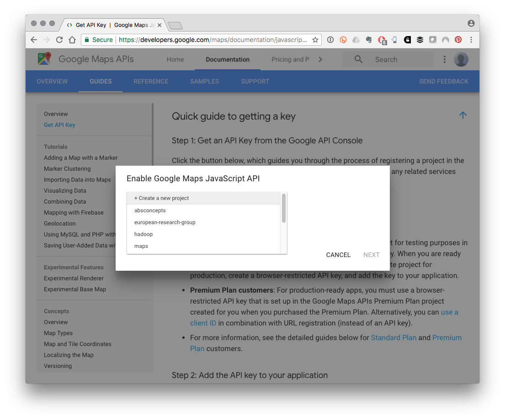

# Geocoding {#geocoding}
\index{geocoding}

In this Chapter we will explore geocoding, Geocoding is the process of turning location names such as organisation names or addresses into georeferences in the form of latitude and longitude coordinates for representation on a map ^[Reverse geocoding is the process of converting coordinates into named places but will not be covered in this chapter].

Geocoding is a relatively recent and popular way to map activity in geographic space, such as research organisations, patent applicants and patent inventors. Basic geocoding such as clustering records by country can be performed using country codes or country names in free tools such as Tableau Public. 

This chapter addresses a more advanced form of geocoding using web services, and specifically the Google Maps API to geocode thousands of organisation names from Web of Science data. The Google Maps API can be accessed in a range of programming languages such as Python or R. We will focus on illustrating the issues involved in geocoding sing the `placement`, `ggmap`, and `googleway` packages in R. We will work with some raw data from Clarivate Analytics [`Web of Science`](http://wokinfo.com/) database of scientific literature. Many universities have access to Web of Science and it is a very important tool in fields such as bibliometrics/scientometrics. 

Geocoding is the process of taking a name and address and looking up the geographic coordinates expressed in latitude and longitude. This is normally done using a web service. There are plenty of example walkthroughs on how to do this. However, many of them start with data that is already clean. We will be working with data that is really rather messy.   

What we are attempting to do is to obtain the addresses and coordinates from the author affiliations field in Web of Science records. Our dataset is from a set of queries for scientific literature for South East Asia (ASEAN) countries that involve marine organisms. We have a table with 5,206 author affiliation details containing the names of organisations, the city and the country. This data is not clean and contains multiple minor variations of the same organisation name. The data also contains variations in geographic locations such as references to a district within a city rather than the name of the city itself. To follow the walk through you can download the data from Github [here](https://github.com/wipo-analytics/data-handbook/raw/master/affiliation_records.csv). It simply contains the author affiliation name and a count of the number of records. 

One of the issues with Web of Science data is that the names of organisations are abbreviated/stemmed (so that University becomes Univ, Institute becomes Inst and so on and so on). Until recently this made geocoding a significant headache. However, as we will see below the Google Maps API now seems to do a very good job of handling these issues but considerable care is needed when interpreting the results. 

In this Chapter we will go step by step through the process of geocoding and deal with the issues we encounter along the way. At the end of the article we will pull the code together to identify a more efficient way to deal with geocoding Web of Science and similar data. 

By the end of this Chapter you will be familiar with what geocoding is and how to carry out geocoding using the `placement`, `ggmap` and `googleway` packages in R with RStudio. You will also be familiar with the Google Maps API and be able to identify and retrieve missing data using packages from the tidyverse. We will take what we learned and combine it into more efficient code for solving the problem and finish off with a quick map of the results. 

### Getting Started

If you are new to R and RStudio then first we need to get set up. To install R for your operating system choose the appropriate option [here](http://cran.rstudio.com/) and install R. Then download the free RStudio desktop for your system [here](https://www.rstudio.com/products/rstudio/download/#download). We will be using a suite of packages called the `tidyverse` that make it easy to work with data. When you have installed and opened RStudio run these lines in your console to install the packages that we will be using. 

```{r installpkg, eval=FALSE}
install.packages("tidyverse")
install.packages("placement")
install.packages("devtools")
install.packages("usethis")
install.packages("googleway")
```

For ggmap we will load the latest version 2.7 that includes `register_google()` for authentication and install it from Github as follows.

```{r eval=FALSE}
devtools::install_github("dkahle/ggmap")
```

Next load the libraries.

```{r load_tidyverse, message=FALSE}
library(tidyverse)
library(ggmap)
library(placement)
library(usethis)
library(googleway)
```

You will now see a range of messages as the packages are loaded. You should now be good to go. 

If you would like to learn more about R then try the excellent [DataCamp](http://www.wipo.int/treaties/en/ip/paris/summary_paris.html) online courses or read Garrett Grolemund and Hadley Wickham's [R for Data Science](http://r4ds.had.co.nz/). Learning to do things in R will make a huge difference to your ability to work with patent and other data and to enjoy the support of the R community in addressing new challenges. There is never a better time to start learning to do things in R than right now.

The `placement`, `ggmap` and recent `googleway` packages all provide functions for geocoding with the Google Maps API. The `placement` package by [Derek Darves](http://derekyves.github.io/) was created in 2016 and provides straightforward access to the Google Maps API and additional tools for address cleaning, calculating distances and driving times. As Derek explains [here](http://derekyves.github.io/2016/07/24/placement-pkg.html). I found it remarkably easy to use and it does not require any complicated code. The function we will be using is `geocode_url()` and `geocode_pull()`. That is basically it. 

While `placement` mainly focuses on geocoding, [`ggmap`](https://github.com/dkahle/ggmap) is a bigger package for mapping in R that includes geocoding. The package is a complement to ggplot2 and a Data Camp course by Charlotte Wickham [Working with Geospatial Data in R](https://www.datacamp.com/courses/working-with-geospatial-data-in-r) will get you started in no time with ggmap and other mapping packages. As we will see below, I ran in to some tricky issues when trying to geocode with ggmap and you may also want to give `googleway` a try. 

We will mainly use the `placement` package because I like the simplicity of the package, but which you use will depend on your purpose and you will probably want to experiment with the wider functionality of `ggmap` or the more recent `googleway`. 

### Getting set up with the Google Maps API

To use the Google Maps API you will need to:

1. Sign in to a Google account
2. Get a free API key from [here](https://developers.google.com/maps/documentation/javascript/get-api-key#get-an-api-key).

This involves pressing the `Get a Key` button and creating a project (app) that you will query by following these steps. 

```{r echo=FALSE}
knitr::include_graphics("images/geocoding/getkey.png")
```

Create a new project and wait a short while while Google spins it up. 

```{r echo=FALSE}

```

You will then see your API key. Note that you will see a link to restrict access to your API. It is a good idea to follow this and use your IP address to limit access to your IP address under Application restrictions. This will prevent other people from using the account if they discover the API key. We will not go down that route right now.

Take a copy of your API key (say into a text file in R Studio). What you do next is up to you. 

a) Save the text file somewhere sensible and copy it into the functions below when needed. 
b) With `usethis` either:

   - `usethis::edit_r_environ()` to open your local environment file and enter something like GOOGLE_MAPS_KEY="yourkey" and then restart R. You will be able to access the key using `Sys.getenv("GOOGLE_MAPS_KEY")`.
   - `usethis::edit_r_profile()` and enter google_maps_key="your key", inside the existing options() chunk, save and restart R. Call the key with `getOption("google_maps_key")`
   
For discussion on the above try reading the R startup section of [Efficient R Programming](https://csgillespie.github.io/efficientR/) or follow the very useful [ROpenSci instructions](https://github.com/ropensci/rOpenSci/wiki/Use-of-API-keys). `usethis` makes life much easier because it knows where the files are!

We will go with the `usethis::edit_r_environ()` environment option, so let's store the key in our working environment for the moment using the imaginatively named key. 

```{r cache=FALSE}
key <- Sys.getenv("GOOGLE_MAPS_KEY")
```

### Using the API

Note that API queries are limited to a free 2500 per day. It costs 50 cents per 1000 queries after that. As this is not expensive we signed up for a billing account to run the full list. As we will see below signing up for an API key is a good idea to avoid problems with the return resulting from pressure on the free service. When you sign up for the API key you still get the 2500 results but make sure you put your API key somewhere safe and do not make it public. 

Below we will briefly show how to use the `placement`, `ggmap` and newer `googleway` packages to retrieve geocode data. Unfortunately the return from the Google API with placement also includes a column called `input_url`. I say unfortunate because the `input_url` includes your private API key! So, if you are planning to make any of this data public you should exclude the `input_url` column. 

### The Source Data

Next let's take a quick look at the source data. When we send the addresses to the Google Maps API with `placement` it will return the original search terms in a column called `locations`. To make our life easier we renamed the original column in our source dataset. Note that the records field refers to the number of publications associated with an address and will allow us to size dots on any map we produce with the results. We can import the data directly from Github. 

```{r import_affiliation, eval=FALSE, echo=TRUE}
affiliation_records <- read_csv("https://github.com/wipo-analytics/data-handbook/raw/master/affiliation_records.csv")
```

```{r save_affiliation, eval=FALSE, echo=FALSE}
save(affiliation_records, file = "data/affiliation_records.rda")
```

```{r load_affiliation, eval=TRUE, echo=FALSE}
load("data/affiliation_records.rda")
```

```{r}
head(affiliation_records)
```

## Lookup the Records

In this section we will look up some of the records with each of the three packages to show how easy it is. Purely from personal preference we will use `placement` for the rest of the work.

### Using placement

The `placement` package can do more than we will attempt here. For example, you can attempt address cleaning or calculating driving distances with `placement`. For our purposes the main event is the `geocode_url()` function, We pass the data in the locations column to the function along with the authentication route and the private key. The `clean = TRUE` argument applies the `address_cleaner` function before encoding the URL to send to the API. The default is set to TRUE and you may want to experiment with setting this value to FALSE. We also add the date of search as it is always useful to know when we carried out the search and we set verbose to TRUE to receive more information. Note that other arguments such as `dryrun` can be useful for debugging problem addresses.

Note that the key can be entered directly into `geocode_url()` as `privkey = Sys.getenv("GOOGLE_MAPS_KEY")`. However, I found that this sometimes returned an error message on long runs. For that reason we might copy it into our local environment (and be careful not to expose it).

```{r eval=FALSE}
key <- Sys.getenv("GOOGLE_MAPS_KEY")
```

```{r run_geocode, eval=FALSE}
library(placement)
coordaffil <- 
  geocode_url(affiliation_records$locations, auth = "standard_api", privkey = key, clean = TRUE, add_date = 'today', verbose = TRUE)
```

```{r drop_inputurl, echo=FALSE, eval=FALSE}
coordaffil <- 
  coordaffil %>%
  select(., -8) # drop input_url as contains the key
```

```{r save_ccordaffil, eval=FALSE, echo=FALSE}
save(coordaffil, file = "data/coordaffil.rda")
```

```{r loadcoordaffil, eval=TRUE, echo=FALSE}
load("data/coordaffil.rda")
```

### Using ggmap

We can perform the same lookup using `ggmap` and the `geocode()` function. Note that the function defaults to the free allocation of 2500 queries. There are options to return "latlon" and "latlona"" or "more" or "all". In the case of "all" this returns a list with entries of differing lengths that you will need to wrangle. In general use `latlon`, `latlona` or `more` as this will return a data frame. Here we will just test 100 records. `geocode()` does not return the input URL with our private key (which is good).

```{r eval=FALSE}
library(ggmap)
coord_ggmap <- 
  geocode(location = affiliation_records$locations[1:100], 
output = "more", source = "google", 
messaging = FALSE)
```

When using `ggmap` I encountered a significant number of `OVER_QUERY_LIMIT` entries in the return. Why is something of a mystery although as discussed [here](https://stackoverflow.com/questions/36175529/getting-over-query-limit-after-one-request-with-geocode) this may because we are sharing the call to the free service with others. It is therefore better to get a key if you are going to be using this service. To authenticate using `ggmap` (2.7 only) create a key based on the key in your environment file. Pass it to `register_google()` and then you are ready to make the call. 

```{r eval=FALSE, cache=FALSE}
key <- Sys.getenv("GOOGLE_MAPS_KEY")
register_google(key = key)
```

It will now work smoothly.

```{r eval=FALSE}
library(ggmap)
ggmap1 <- 
  geocode(location = affiliation_records$locations[201:300],
output = "more", source = "google",
messaging = FALSE)
```

This overcame the limitation and returned a data.frame with 100 entries.

```{r eval=FALSE, echo=FALSE}
save(ggmap1, file = "data/ggmap1.rda")
```

```{r echo=FALSE}
load("data/ggmap1.rda")
```

```{r}
ggmap1 %>% 
  select(1:4) %>% 
  head()
```

### Using Googleway

An alternative to `placement` or `ggmap` is also available using the `googleway` package. `googleway` includes access to the Google APIs for directions, distance, elevation, time zones, places, geocoding and reverse geocoding and so has a wider set of uses. However, `googleway` is expecting an address field of length 1 (meaning it takes one address at a time) whereas placement and ggmap are vectorised. The return from googleway returns a list object containing a data frame with the results and the status of the return. Here is one quick example.

```{r eval=FALSE}
library(googleway)
googleway <- 
  google_geocode(address = "Aarhus Univ Biosci, Roskilde, Denmark", key = Sys.getenv("GOOGLE_MAPS_KEY"), simplify = TRUE)
```

For long lists we would therefore need to use an approach such as `lapply()` or `purrr::map()` to make the call as a set and then look at ways to bind the results together. 

```{r eval=FALSE}
googleway2 <- 
  purrr::map(affiliation_records$locations[1:2], google_geocode, key = Sys.getenv("GOOGLE_MAPS_KEY"), simplify = TRUE)
```
<!--- identify a solution to bind into a df, as I have forgotten, again!---->

As this makes clear, you have at least three choices for geocoding and which you prefer will depend on your needs. I found `ggmap` rather awkward because the existing CRAN version (2.6) does not provide the `register_google()` function in the long standing 2.7 development version. While this is a bit awkward `ggmap` provides some very powerful features that you will want to use. On the other hand `googleway` would involve some more work to vectorise over the list as we started exploring above. `placement` on the other hand is fine with the only disadvantage being the return of the API key in the input URL that we have to remember.  

## Reviewing Initial Results

When we originally started working with the Google API in 2017 the API returned 3,937 results from the 5,206 names. This then required a lot of additional work to retrieve the remaining numbers by cleaning up abbreviations and country names. However, the Google Maps API seems to have improved rather radically in the meantime.

Let's take a look at the issues that can arise with the return from the Google Maps API. For the moment we will focus on the completeness of the data revealed in status and error messages. 

```{r}
coordaffil %>%
  select(location_type, status, error_message) %>%
  head()
```

The return from placement is a data.frame that is exactly the same length as our input. What we need to watch out for are the entries in the status column and the error message column. Here we need to be cautious because most of the time the API returns either "OK" or "ZERO_RESULTS". However, there are additional status codes listed [here](https://developers.google.com/maps/documentation/geocoding/intro) and they are also listed in the documentation for `geocode_url()`. They are:

- "OK"
- "ZERO_RESULTS"
- "OVER_QUERY_LIMIT"
- "REQUEST_DENIED"
- "INVALID_REQUEST"
- "UNKNOWN_ERROR"
- "CONNECTION_ERROR" (added)

When running a long set of addresses the CONNECTION_ERROR can creep into the data, so be aware of this. 

We can now join our data sets together. We will use `left_join()` for convenience and specify the column to join on as the shared `locations` column. 

```{r create_results}
results <- 
  dplyr::left_join(affiliation_records, coordaffil, by = "locations")
```

We can identify the results found so far by filtering on the status field which will show "OK" where there is a return and "ZERO_RESULTS" where the geocoding did not work:

```{r, resultsfound}
results %>%
  filter(., status == "OK")
```

For the results that were not found it is safest not to simply filter for ZERO RESULTS but instead to filter for anything that is not OK using `!=`. This can save on endless hours of confusion where you have multiple messages in the status column.  

```{r lookup}
lookup <- results %>%
  filter(., status != "OK")
nrow(lookup)
```

So, we have 19 records with no results. That is pretty good from just over 5000 results. 

```{r showmissing}
lookup %>%
  select(-id)
```

When dealing with thousands of records it is often a good idea to add a cut off threshold. For example we can see above that with two exceptions the entries are all for 1 or 2 records. As these will be barely visible on a map you may want to set a cut off point to focus in on the more important records. 

However, the lookup table highlights an issue that the Google Maps API previously struggled to deal with: abbreviations. When working with scientific literature abbreviations in author affiliations along with acronyms are common. So, lets look at how to deal with that.  

### Tackling Abbreviations

Here we have created a simple file containing some of the major Web of Science organisation abbreviations and their matches. It is probably not complete but is a good start. Next we added a column with word boundaries that we will use to find and replace the abbreviations. You can download the the file directly from Github.

```{r import_abbreviation_dictionary, eval=FALSE}
wos_abbreviations <- read_csv("https://github.com/wipo-analytics/data-handbook/raw/master/wos_abbreviations.csv", 
  col_types = cols(abbreviation = col_character(), 
    text = col_character()))
```

A simple word boundary regular expression was added to assist with matching. 

```{r abbreviations_wordbounds, eval=FALSE}
wos_abbreviations$regex <- 
  paste0("\\b", wos_abbreviations$abbreviation, "\\b")
```

```{r save_abbr, eval=FALSE, echo=FALSE}
save(wos_abbreviations, file = "data/wos_abbreviations.rda")
write_csv(wos_abbreviations, "data/wos_abbreviations.csv")
```

```{r load_abbreviations, echo=FALSE, eval=TRUE}
load("data/wos_abbreviations.rda")
```

```{r echo=FALSE}
head(wos_abbreviations)
```

To replace the abbreviations we will want to temporarily separate out the city and the country names in the locations column. This helps us to avoid transforming them by accident. We will bring the edited version back together later. Web of Science data uses a comma to separate out the entities and so we use that in a call to separate. We also keep the original column by specifying `remove = FALSE` as the default removes the input column. 

```{r separate_city}
lookup <- 
  lookup %>% 
  separate(., locations, c("organisation", "city", "country"), sep = ",", remove = FALSE)
```

```{r echo=FALSE}
save(lookup, file = "data/lookup.rda")
```

```{r echo=FALSE}
load("data/lookup.rda")
```

```{r show_lookup1, echo=FALSE}
lookup %>% 
  select(., 1:6) %>%
  head()
```

```{r write_lookup, echo=FALSE, eval=FALSE}
# used to identify abbreviations to fix in Vantage Point
write_csv(lookup, "data/lookup_affiliation.csv")
```

Next we want to iterate over the list of our organisation names and replace the abbreviations. There are a variety of ways to do that such as the `qdap` package function `multigsub()` or `mgsub()`. We like `qdap` a lot but installation of the package can be a bit awkward due to a dependency on `rJava`.^[If you would like to install `qdap` but run into problems with `rjava` on a Mac the instructions [here](https://github.com/MTFA/CohortEx/wiki/Run-rJava-with-RStudio-under-OSX-10.10,-10.11-(El-Capitan)-or-10.12-(Sierra)) can solve installation problems.] Instead we are going to use a simple for loop (although a `purrr` solution would be an improvement).

```{r fun_replaceabbr}
replaceabbr <- function(pattern, replacement, var) {
  replacement <- rep(replacement, length(pattern)) 
    for (i in seq_along(pattern)) {
        var <- gsub(pattern[i], replacement[i], var)
        }
  var
} 
```

One issue with cleaning names is capitalisation. For example, in our wos abbreviations file we have used `Univ` as the most common abbreviation for University. However, this will not match UNIV and so we will be better off regularising the text. A common convention is to convert everything to lower case using `tolower()` at the start of working with the data. Here we don't want to do that. We will use the extremely useful `stringr` package to convert the organisation name to to title case in a new field that we will call organisation_edited. The reason that we are not editing our original column is that at some point we will want to join the table back on to our original dataset...so we don't want to touch our original column. We will do this using `mutate()` from `dplyr()`.

```{r}
lookup <- lookup %>%  
  mutate(organisation_edited = str_to_title(.$organisation))
lookup %>% select(organisation_edited)
```

```{r echo=FALSE}
save(lookup, file = "data/lookup.rda")
```

```{r echo=FALSE}
load("data/lookup.rda")
```

Next, we transform the abbreviations using replaceabbr. 

```{r apply_reoplaceabbr}
lookup$organisation_edited <- 
  replaceabbr(wos_abbreviations$regex, wos_abbreviations$text, lookup$organisation_edited)
```

```{r echo=FALSE}
save(lookup, file = "data/lookup.rda")
```

```{r echo=FALSE}
load("data/lookup.rda")
```

```{r show_lookup}
lookup %>% 
  select(organisation_edited)
```

This is not perfect, for example we encounter issues with Agriculture and Agricultural and so on. We also encounter issues of capitalisation in the city and the country field that we are presently ignoring. However, it is good enough for the time being. Rather than focus on resolving a small number of remaining items the next step is to reunite the fields we separated into a field we will call locations edited using the `tidyr` `unite` function. 

```{r create_locateionsedited}
lookup <- lookup %>%
  unite(., locations_edited, c(organisation_edited, city, country), sep = ",", remove = FALSE)

lookup %>%
  select(organisation, city, country, locations_edited)
```

```{r save_lookup, echo=FALSE}
save(lookup, file = "data/lookup.rda")
```

```{r load_lookup, echo=FALSE, eval=TRUE}
load("data/lookup.rda")
```

Note that rather than creating a separate character vector we made life easier by simply adding `locations_edited` to our lookup data.frame (because the vectors are of the same length) using `unite()`.

### Lookup edited names

We now send the cleaned up version off to the Google API. 

```{r coordlookup, eval=FALSE, cache=FALSE}
library(placement)
coordlookup <- geocode_url(lookup$locations_edited, auth = "standard_api", privkey = key, clean = TRUE, add_date = 'today', verbose = TRUE)
```

<!--- save and then load the lookup--->
```{r save_coordlookup, eval=FALSE, echo=FALSE}
coordlookup <- coordlookup %>% select(., -8) # drop input_url
save(coordlookup, file = "data/coordlookup.rda")
```

```{r load_coordlookup, echo=FALSE}
load("data/coordlookup.rda")
```

Let's take a look. 

```{r count_coordlookup}
coordlookup %>% 
  select(locations, status)
```

So, 8 of our revised names have failed to produce a return. In some cases this is a little surprising. For example the private Kitasato University would be expected to come up, but the reference to Aomori seems to have confused the mapper (as the University is listed as located in Minato). In the case of the Institute Oceanography Vast we can see that there is duplication (Vast refers to the Vietnam Academy of Science and Technology as the parent organisation of the institute) with the second and third entries being recognised. Other variants such as `Nha Trang Institute Oceanography, Khanh Hoa Prov, Vietnam` and the acronym `Vnio, Nha Trang, Vietnam` are also missed. How far you want to push with fixing addresses is up to you and will depend on your purposes. As mentioned above, to avoid a long tail of unresolved addresses for low frequency data you may want to use a cut off on the number of records.

### Bringing the data together

To join the data back together we need to do some tidying up on the lookup and coordlookup table first. Recall that we sent edited names to Google and those were returned as `locations`. This means that they will not match with the names in our original table. We also created some additional columns. To create tables that will match the original table we need to tidy up by:

a) selecting the original columns in lookup plus locations_edited (our join field)
b) renaming locations to locations_edited in the lookup results (the join field)
c) join the tables
d) drop the locations-edited column

```{r echo=FALSE}
load("data/lookup.rda")
```

```{r}
lookup <- lookup %>% 
  select(records, locations, locations_edited, id) 

coordlookup <- coordlookup %>%
  rename(locations_edited = locations)

res <- left_join(lookup, coordlookup, by = "locations_edited") %>% 
  select(-locations_edited)
```

```{r echo=FALSE}
save(res, file = "data/res.rda")
```

```{r echo=FALSE}
load("data/res.rda")
```

To join the data back together we now need to do two things. First we filter the results from the original search to those that are `status == "OK"` and then bind the `res` table to the end.

```{r}
results_complete <- results %>%
  filter(., status == "OK") %>% 
  bind_rows(., res)
```

We will write the results to an Excel and csv file that we can use in other programmes such as Tableau for mapping (we will briefly look at mapping with R below).

```{r writefile, eval=FALSE}
writexl::write_xlsx(results_complete, path = "asean_geocode_complete.xlsx")
write_csv(results_complete, path = "asean_geocode_complete.csv")
```

We now have a complete set of geocoded results with 5,198 locations from 5,206. That is pretty good. However, having obtained the geocoded data and joined it onto our original data.frame we now need to look at the quality of the return. 

### Assessing the Quality of Geocoding

So far we have focused on getting geocoded data without really looking at it. To assess the quality of the data that has been returned we should take a look at the location type field. The API documentation for these entries can be found [here](https://developers.google.com/maps/documentation/geocoding/intro) and in the `geocode_url()` documentation.

```{r}
results_complete %>%
  drop_na(location_type) %>% 
  count(location_type, sort = TRUE) %>% 
  mutate(prop = prop.table(n))
```

The API documentation fills us in on what is going on here. 

>"location_type stores additional data about the specified location. The following values are currently supported:

>"ROOFTOP" indicates that the returned result is a precise geocode for which we have location information accurate down to street address precision.

>"RANGE_INTERPOLATED" indicates that the returned result reflects an approximation (usually on a road) interpolated between two precise points (such as intersections). Interpolated results are generally returned when rooftop geocodes are unavailable for a street address.

>"GEOMETRIC_CENTER" indicates that the returned result is the geometric center of a result such as a polyline (for example, a street) or polygon (region).

>"APPROXIMATE" indicates that the returned result is approximate."

What this tells us is that Google believes it has reached rooftop accuracy for 2155 records but has selected the geometric centre or an approximate value for around 58% of the entries. Lets take a closer look at the geometric center data. 

```{r}
results_complete %>% 
  filter(location_type == "GEOMETRIC_CENTER") %>% 
  select(locations, lat, lng, formatted_address)
```

A review of these results suggests that the geometric center data is pretty good. In the past we might have ended up in a different country. But what about the approximate results?

```{r}
results_complete %>% 
  filter(location_type == "APPROXIMATE") %>% 
  select(locations, lat, lng, formatted_address)
```

The approximate results are a mixed bag, in some cases the coordinates focus on a city or town. In other cases such as `Adv Choice Econ Pty Ltd, Bateman, Australia` the coordinate is for a country and so on. 


## Preprocess the Data and Rerun the Query

This suggests to me at least that while the geocoding is OK the prevalence of geometric centre and approximate results suggests that we might want to run this again but this time edit the location names first to see if we can improve the accuracy of the results. We now know that we can geocode pretty much all of this data. What we are interested in now is whether we can improve the accuracy of the geocoding. 

```{r eval=FALSE, cache=FALSE}
# import data and separate out the organisation country and city into new columns
affiliation2 <- read_csv("https://github.com/wipo-analytics/data-handbook/raw/master/affiliation_records.csv") %>%
  separate(locations, c("organisation", "city", "country"), sep = ",", remove = FALSE) 

# import abbreviations
wos_abbreviations <- read_csv("https://github.com/wipo-analytics/data-handbook/raw/master/wos_abbreviations.csv", 
  col_types = cols(abbreviation = col_character(), 
    text = col_character()))

# function to replace the abbreviations
replaceabbr <- function(pattern, replacement, var) {
  replacement <- rep(replacement, length(pattern)) 
    for (i in seq_along(pattern)) {
        var <- gsub(pattern[i], replacement[i], var)
        }
  var
} 

# regularise organisation names

affiliation2 <- affiliation2 %>%  
  mutate(organisation_edited = str_to_title(.$organisation)) %>% 
  mutate(city = str_to_title(.$city)) %>% # added
  mutate(country = str_to_title(.$country)) #added

# fix abbreviations

affiliation2$organisation_edited <- 
  replaceabbr(wos_abbreviations$regex, wos_abbreviations$text, affiliation2$organisation_edited)

# unite cleaned up fields

affiliation2 <- affiliation2 %>% 
  unite(., locations_edited, c(organisation_edited, city, country), sep = ",", remove = FALSE)

# run the search 
 
run1 <- placement::geocode_url(affiliation2$locations_edited, auth = "standard_api", privkey = key, clean = TRUE, add_date = 'today', verbose = TRUE)

# drop the input-url and rename for join
run1 <- run1 %>%
  select(-8) %>% 
  rename(locations_edited = locations)

# join to the input table

res_complete <- left_join(affiliation2, run1, by = "locations_edited") 

res_complete <- res_complete %>% 
  mutate(duplicate_id = duplicated(id)) %>% 
  filter(duplicate_id == "FALSE")
```

When we join the two tables together we discover that we arrive at 5232 rather than 5,206 results. The reason for this is that the name harmonisation has created duplicated names from formerly distinct names. The Google API returns duplicate entries in these cases. These duplicate entries have been filtered out above. We will come on to other forms of duplication below. 
<!---investigate this further. The Ids are distinct in affiliation 2 but then x entries are duplicated in the return from the API --->

```{r echo=FALSE, eval=FALSE}
save(run1, file = "data/run1.rda")
```

```{r echo=FALSE}
load("data/run1.rda")
```

Ok let's take a look at our results to assess whether this is an improvement. 

```{r}
run1 %>%
  drop_na(location_type) %>% 
  count(location_type, sort = TRUE) %>% 
  mutate(prop = prop.table(n))
```

What this has done is improved the rooftop resolution by a couple of percentage points and improved the geometric centre results by about the same. The approximate score has dropped to 19% from 23% so this is definitely progress. In total 214 records have moved up from the approximate to the rooftop or geometric centre location_types. As this suggests, improving the quality of geocoding matters and it is therefore worth putting the effort into improving the resolution of the results. 

### Duplicated Affiliation Names

```{r echo=FALSE, eval=FALSE}
save(affiliation2, file = "data/affiliation2.rda")
```

```{r load_affiliation2, echo=FALSE, eval=TRUE}
load("data/affiliation2.rda")
```

```{r eval=FALSE, echo=FALSE}
save(res_complete, file = "data/res_complete.rda")
```

```{r load_res_complete, echo=FALSE}
load("data/res_complete.rda")
```

It will not have escaped your attention that in reality our original input data contained a significant amount of duplication on organisation names. This becomes obvious when we review the organisation edited field. We can rapidly see multiple entries.

```{r}
affiliation2 %>% 
  count(organisation_edited, sort = TRUE)
```

There are a number of reasons for this. In some cases researchers may list different departments or institutes along with the name of their organisation. In other cases an organisation (such as the Chinese Academy of Science or CNRS) may have multiple offices within or outside a particular country. In still other cases, such as Department Fisheries or Ministry Health we are lumping together organisations that share the same name but are distinct entities. 

Lets take a closer look at this. 

```{r}
affiliation2 %>% 
  select(locations, organisation_edited) %>% 
  head(20)
```

In the case of Aarhus University, we can see that we have Aarhus University Bioscience, Aarhus University Hospital and an Aarhus University. In some cases the entities belong to the organisation but might otherwise be regarded as distinct (Aarhus University Hospital) while in another the Bioscience reference refers to a department (but gives the impression that it may be a separate University as for Agricultural cases). To add to this we note that there are locations in Aarhus and Roskilde and a minor variant (Aarhus C) in the address field. 

As this makes clear address field data in scientific names is pretty messy because authors choose how to denote their affiliations, and are perhaps rebelling against the tyranny of performance indicators and endless research assessment exercises. 

Cleaning up author affiliation and author names is generally a painful process (and we will come back to this in a future article). One challenge with name cleaning is the availability of criteria to determine if a name can be merged. For example, we could comfortably merge some of the Aarhus University references above but we might want to keep distinct locations distinct (for example Aarhus is around 150km by road from Roskilde). The availability of georeferenced data, bearing in mind the approximates issue, could provide us with additional information for informed decision making during name cleaning. Let's take a quick look at the formatted address field in our results. 

```{r}
res_complete %>% 
  select(formatted_address, organisation_edited) %>% 
  head(20)
```

Here we can see that the Google data suggests that some of these entities share an address. Based on this we may want (with appropriate attention to the location type field as a guide) to merge or not merge names in our list. If we take a look at the counts for shared addresses it becomes clear that we may want to use a step wise approach depending on the level of confidence in the location type field. 

```{r}
res_complete %>%
  filter(location_type == "ROOFTOP") %>% 
  count(formatted_address, sort = TRUE)
```

### Quickly Mapping the Data

To finish off lets quickly map the data. We will focus on mapping in more detail in other articles in the Handbook. For the moment we will use the leaflet package for this.

```{r install_leaflet, eval=FALSE}
install.packages("leaflet")
```

```{r}
library(leaflet)
mapdata <- res_complete %>% 
  filter(., status == "OK")
mapdata <- leaflet(mapdata) %>%
  addTiles() %>%
  addCircleMarkers(~lng, ~lat, popup = .$locations_edited, radius = mapdata$records / 20, weight = 0.1, opacity = 0.2, fill= TRUE, fillOpacity = 0.2) 
mapdata
```

As this makes clear it is relatively straightforward to generate quick maps with R and even easier to export the data to tools such as Tableau for publication quality and interactive maps. We will go into mapping in more depth in a future article. 

## Round Up

In this article we looked at three R packages for geocoding data on research affiliations from the scientific literature using Web of Science. We focused on the use of the `placement` package as it is very easy to use. However, your needs may differ with packages such as `ggmap` and `googleway` offering different functionality. 

The main take away message is that geocoding using the Google Maps API will normally be an iterative process that may requires multiple passes and adjustments to the data to arrive at accurate results. One things should now also be clear, while the Google Maps API has dramatically improved in its ability to offer geocoded results (including on messy names) these results should not be taken at face value. Instead, and depending on your purpose, multiple iterations may be needed to improve the resolution of the results. In this article we have not gone all the way with this but have hopefully provided enough pointers to allow you to take it further. 

R is a functional programming language meaning that it will be feasible to construct a function that brings together the functions used to process the data in the above steps. We will not go there today, but to round up lets think about some of the elements that we might want to use to address this in a single R function based on the steps that we have taken above. 

- import dataset
- address case issues
- separate organisation, city, country
- resolve abbreviations on organisation names
- unite organisation, city and country into a new field
- send the cleaned field to the API and retrieve results
- adjust column names to match
- join results to original
- review the location type 
- adjust and rerun as needed to improve rooftop and geometric centre results vs. approximate results

In many cases it will make sense to choose a threshold based on counts of records before sending the data to the API. For example where dealing with publications (as in this case) it could make sense to exclude records where there is only one record. For example, in our original input table 1,624 entries only had one record. If no one is ever likely to look at data points with only one record you may wish to filter them out and concentrate on the accuracy of geocoding for scores above the threshold. 

We have also seen that while the focus of geocoding is logically on mapping, in reality geocoding services may offer new opportunities for the vexed problem of accurate name cleaning when working with the scientific literature or patent data. We will look at this in more detail in a future article. For the moment, congratulations, you have survived geocoding using the Google Maps API in R. 

# References
