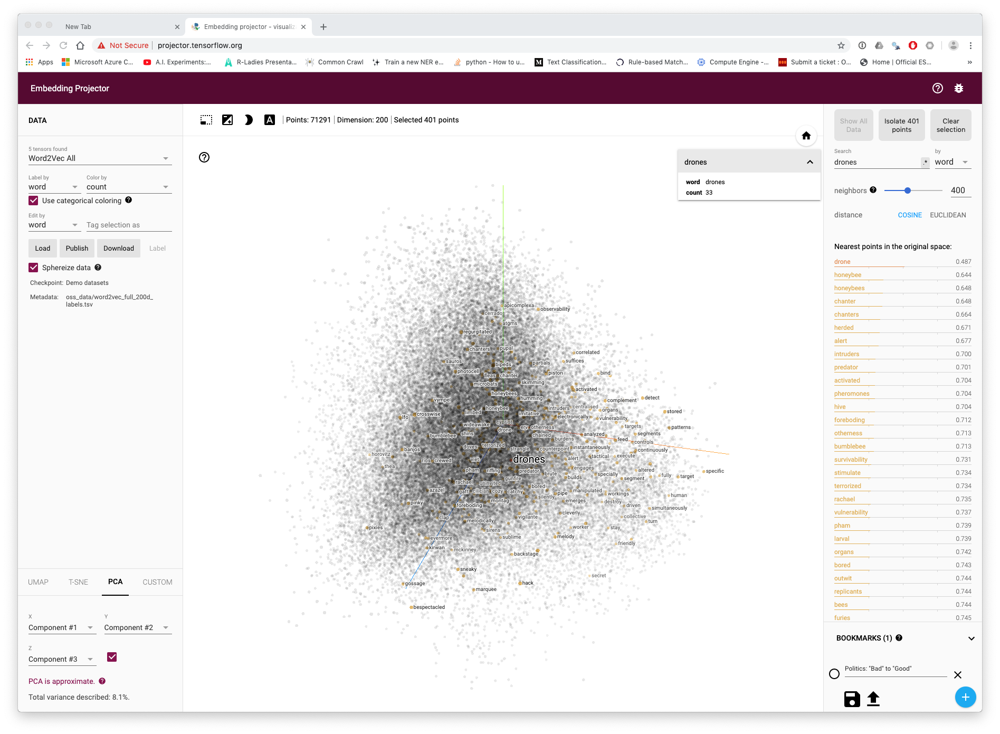

# Machine Learning {#machinelearning}
\index{machinelearning}

### Artificial Intelligence & Machine Learning

<!--- highlihgt the difference between word2vec, Glove, and fastext as they have some impotant differences notably fastext capturing out of word vocabularies. Reference gensim for word vector creation in python--->

<!--- Google patent embeddings on big query---->

_Please note this is a working draft and is likely to be substantially revised. Citations are incomplete_

In recent years Artificial Intelligence has become a focus of discussion for its potentially transformative and disruptive effects on economy and society. The recent rise of artificial intelligence in the patent system is the focus of a landmark 2019 WIPI Technology Trends Report "Artificial Intelligence" [https://www.wipo.int/publications/en/details.jsp?id=4386](https://www.wipo.int/publications/en/details.jsp?id=4386). The in depth review of patent activity revealed that it is one of the fastest growing areas of patent activity with inventions that are applicable across diverse fields such as telecommunications, transportation, life and medical sciences, personal devices and human-computer interactions. Sectors identified in the WIPO report include banking, entertainment, security, industry and manufacturing, agriculture and networks. Perhaps the best known "flagship" initiative for artificial intelligence is the pursuit of self-driving cars by Tesla and Google among others. However, many companies, including those that work in the domain of patent analytics are increasingly claiming that they apply artificial intelligence as part of their products. 

When approaching artificial intelligence it is important to look beyond the hype and marketing strategies to the underlying technology. In practical terms this can be described as computer based approaches to classification with respect to images and texts. The dominant approach to classification involves a range of computational machine learning approaches that have been undergoing rapid development in recent years. 

Examples of the use of machine learning approaches to classification tasks include predictive text entry on mobile phones, a technology anticipated in the 1940s by researchers in China [wikipedia]. A patent for an assistive device for deaf people involving predictive text was awarded in 1988 (US4754474A) [wikipedia]. The rise of mobile phones witnessed an explosion in the development and use of predictive text applications. Predictive text is also widely used in search engines to suggest phrases that a user may wish to use in their search. Other applications include spam filtering for emails or suggesting similar items that a customer might be interested in on online shops. 

While text classification is perhaps the main everyday area where machine learning is encountered in practice image classification has been the major focus of development and is reflected in the prominence of image classification challenges on Kaggle. The implementation of image classification approaches is reflected in everyday terms in image searches in online databases which suggest relevant images and suggestions for tagging of images and persons in social media applications. Image classification is also an important area of innovation in areas such as medical diagnostics, robotics, self-driving cars or facial recognition for security systems. A separate but less visible area of development is control systems. The online data science platform [Kaggle](https://www.kaggle.com/competitions) serves as a host for competitions and challenges in machine learning such as image classification and can provide an insight into the nature of machine learning developments. 

A 2017 report by the UK Royal Society "Machine learning: the power and promise of computers that learn by example" provides a valuable overview of machine learning approaches.^[[https://royalsociety.org/-/media/policy/projects/machine-learning/publications/machine-learning-report.pdf](https://royalsociety.org/-/media/policy/projects/machine-learning/publications/machine-learning-report.pdf)]. For our purposes, the Royal Society report highlights the key underlying feature of machine learning: learning by example. 

As we will see in this chapter machine learning approaches commonly involve training a statistical model to make _predictions_ about _patterns_ (in texts or in images). Training of machine learning models is normally based on the use of examples. The quality of the predictions that are produced by a model is heavily dependent on the quality and the number of examples that it is trained on. 

The development of machine learning models proceeeds in a cycle from the collection and pre-processing of training data, to the development of the model with the training data followed by evaluation of the performace of the model against previously unseen data (known as the evaluation or test set). Based on the results more training data may be added and the parameters of the model adjusted or tuned to optimise performance. When a robust model has been developed it can then be used in production to automate the classification tasks. 

Machine learning involves a range of different algorithms (that may at times be used in combination), examples include the well known Principal Component Analysis (PCA), linear regression, logistic regression (for classification), decisio-trees, K-means clustering, least squares and polynomial fitting, and neural networks of a variety of types (e.g convolutional, recurrent and feed forward). Some of the algorithms used in machine learning predate the rise in popularity of the term machine learning and would not be accepted as machine learnig (e.g. PCA and regression models). Readers interested in learning more about the algorithms involved in machine learning will discover a wide range of often free online machine learning courses such as from popular platorms such as Coursera, Udemy, Edx and Data Camp to name but a few. For text classification the Stanford Course "Stanford CS224N: NLP with Deep Learning" provides 20 hours of video lectures that provides a detailed insight into many of the topics addressed in this chapter.^[[https://www.youtube.com/playlist?list=PLoROMvodv4rOhcuXMZkNm7j3fVwBBY42z](https://www.youtube.com/playlist?list=PLoROMvodv4rOhcuXMZkNm7j3fVwBBY42z)] 

However, while it is important to engage with the background to machine learning algorithms, in reality machine learning is becoming increasingly accessible for a range of classification tasks in two ways.

a) through fee based online cloud services offered by Google, Amazon, Microsoft Azure and others that will perform specific classification tasks at scale such as image classification without a requirement for advanced training;
b) the availability of free open source packages such as scikitlearn, fastText (Facebook), keras and spaCy (Explosion AI)

One of the challenges writing about machine learning is making the processes involved visible. To make it easier to engage with machine learning we will use the free Python Natural Language Processing library `spaCy` and the associated fee based `Prodigy` annotation and model training tool from Explosion AI in Germany. While skikitlearn, fasttext and keras are also major tools, spaCy and Prodigy have the considerable advantage of allowing end to end transparency in writing about the steps innvolved in developing and applying machine learning models.

This chapter focuses on a basic machine learning workflow involving the following steps:

1. Creating seed terms from word vectors to build a text classification model, training the model and testing it. 
2. Named Entity Recognition. Training a model to recognise entities of interest within the texts identified by the true or false model.
3. Using a model to classify and identify named entities in a text

### Word Vectors

>"You shall know a word by the company it keeps (Firth, J. R. 1957:11)"

In the last chapter we explored approaches to text mining that do not involve the use of machine learning models. This involved text mining to identify terms for a dictionary that would allow for the identification of texts that contain one or more terms using ngrams. 

Dictionary based methods provide powerful tools for analysis. However, they suffer from two main issues. 

a) they will only ever return exactly the same terms that are in the dictionary. That is, they cannot identify nearby or closely related terms. 
b) dictionary based methods can be very memory intensive particularly if the dictionaries involved are very large. 

To overcome the first of these issues it is now common practice to combine dictionary approaches with a statistical model to more accurately classify texts at various levels of detail. That is to add a statistical learning component to improve classification. 

In the case of the second issue it is important to bear in mind that machine learning models can be more demanding on memory and computational resources than dictionary based methods. However, as we will discuss below, the availability of machine learning models allows for the development of strategies to minimise demands on memory and computational power such as initially training a model with a very large dictionary and then deploying a purely statistical based model without the dictionary. Much however will depend on the precise task at hand and the available memory and compute power available. In this chapter we assume that you will be using a laptop with a modest 16Gb of Ram.

#### Word Vectors

In the last chapter we used Vantage Point to create a co-occurrence matrix to build search terms and to refine analysis of a dataset. A co-occurrence matrix can be built in Vantage Point either as a count of the number of times that words or phrases in a dataset co-occurr with each or using measures such as cosine similarity. 

One straightforward way of thinking about a word vector is as a co-occurrence matrix where words are transformed into numeric values and the vocabulary is cast into a multidimensional vector space. Within that space words with the same or similar meanings will be closer (in terms of scores or weights). More precisely, words that _share similar contexts_ will have the same or similar meanings while words with dissimmliar meanings will be further away. This observation is an important departure point for word vectors compared with a straightforward co-occurrence matrix that counts the number of times that words occur together in a given set. The reason for this is that the focus is on the context, or the company that a word is keeping. As we will see in a moment, word vectors are _learned representations_ of the relationships between words based on minimisation of the loss (error) of a predictive model.^[https://medium.com/@jayeshbahire/introduction-to-word-vectors-ea1d4e4b84bf](https://medium.com/@jayeshbahire/introduction-to-word-vectors-ea1d4e4b84bf) 

The seminal paper on word vectors by Mikolov et al 2013 neatly summarises the problem they seek to address as follows:

>"Many current NLP systems and techniques treat words as atomic units - there is no notion of similarity between words, as these are represented as indices in a vocabulary. [@lens.org/104-512-929-235-758]

The problem that Mikolov and co-authors identify is that the development of approaches such as automatic speech recognition is constrained by dependency on high quality manual transcripts of speech containing only millions of words while machine translation models are constrained by the fact that "...corpora for many languages contain only a few billions of words or less" [@lens.org/104-512-929-235-758]. Put another way, the constraint presented by approaches at the time was that the examples available for computational modelling could not accommodate the range of human uses of language or more precisely, the meanings conveyed. Mikolov et. al. successfully demonstrated that distributed representations of words using neural network based language models outperfornmed the existing Ngram (words and phrases) models on much larger datasets (using 1 million common tokens from the Google News corpus) [@lens.org/104-512-929-235-758]. 

>"We use recently proposed techniques for measuring the quality of the resulting vector representations, with the expectation that not only will similar words tend to be close to each other, but that words can have multiple degrees of similarity [20]. This has been observed earlier in the context of inflectional languages - for example, nouns can have multiple word endings, and if we search for similar words in a subspace of the original vector space, it is possible to find words that have similar endings [13, 14].
Somewhat surprisingly, it was found that similarity of word representations goes beyond simple syntactic regularities. Using a word offset technique where simple algebraic operations are performed on the word vectors, it was shown for example that vector(”King”) - vector(”Man”) + vector(”Woman”) results in a vector that is closest to the vector representation of the word Queen [20]."

This observation has become one of the most famous in computational linguistics and is worth elaborating on. In a word vector it was found that.  

> King - Man + Woman = Queen

In a 2016 blog post on "The amazing power of word vectors"  Adrian Coyler provides the following illustration of how this works. Note that the labels do not exist in the vectors and are added purely for explanation in this hypothetical example. [https://blog.acolyer.org/2016/04/21/the-amazing-power-of-word-vectors/](https://blog.acolyer.org/2016/04/21/the-amazing-power-of-word-vectors/) <!--- to do: request copyright clearance to use the image--->

```{r coyler_vectors, echo=FALSE}
knitr::include_graphics("images/word2vec_coyler.png")
```

Let us imagine that each word in each individual vector has a distributed value across hundreds of dimensions across the corpus. Words like King, Queen, Princess have a high similarity in vector space with the word Royalty. In contrast, King has a strong similarity with Masculinity while Queen has a strong similarity with Femininity. Deducting Man from King and adding Woman can readily be seen to lead to Queen in the vector space. Other well known examples from the same paper lead to the calculation that "big-bigger" = "small:larger" etc. 

<!---In follow up work Mikolov and others at Google released the word2vec tool for the creation of --->

### Word Vectors with fastext

To illustrate the use of word vectors we will use the fastText machine learning package developed by Facebook. 

FastText is a free text classification and representation package produced by Facebook that provides downloadable multi-language models for use in machine learning. At present vecotr models are available for 157 languages. 

FastText can be used from the command line or in Python (fasttext) or in R with the [fastrtext package](https://github.com/pommedeterresautee/fastrtext). FastText is a good way to get started with word vectors and machine learning because it is very easy to install and use. Fasttext is under active development with the latest updates posted on the [fasttext website](https://fasttext.cc/). 

FastText was developed by researchers including Tomas Mikolov as an alternative to the increasingly popular deep learning models for text classification at scale. It is a lightweight tool that emphasises speed in classification [@bojanowski2016enriching; @joulin2016bag; @joulin2016fasttext] and arguably outperforms deep learning models. 

To get started follow [the fastext instructions](https://fasttext.cc/docs/en/support.html) to install fasttext from the command line or in Python. We will demonstrate fasttext in Python but it is easy, if not easier, to run from the command line. 

```{python, eval=FALSE}
git clone https://github.com/facebookresearch/fastText.git
cd fastText
sudo pip install .
# or
sudo python setup.py install

```

Verify the installation

```{python, eval=FALSE}
python
>>> import fasttext
>>>
```

If this has worked correctly you should not see anything after `import fasttext`.

In the Terminal we now need some data to train. The fastext example usses wikipedia pages in English that take up 15Gb. In the terminal download the smaller version as follows. 

```{r, eval=FALSE}
$ mkdir data
$ wget -c http://mattmahoney.net/dc/enwik9.zip -P data
$ unzip data/enwik9.zip -d data
```

As this is an XML file it needs to be parsed. The file for parsing is bundled with fastext as wikifil.pl and you will need to get the path right for your installation. If in doubt download fasttext from the command line, make and then cd into the directory for this step. Record the path to the file that you will need in the next step in Python. 

```{r, eval=FALSE}
perl wikifil.pl data/enwik9 > data/fil9
```

Check that the file has parsed on the command line.

```{r, eval=FALSE}
head -c 80 data/fil9
```

Train word vectors

```{python, eval=FALSE}
import fasttext
model = fasttext.train_unsupervised('/Users/colinbarnes/fastText/data/fil9')
```

### Training Word Vectors for Drones

We will use a small set of patent texts on drones from the drones package for illustration. Ideally use the largest possible set. However, for better results use texts in a single language and regularise the texts so that everything is lower case. You may also improve results by removing all punctuation. 

If we wished to do that in R by way of example we access the title, abstract and claimes table (tac) in the drones training package. We would then combine the the fields, convert to lowecase and then replace all the punctuation with a space. We might tidy up by removing any double spaces created by removing the punctuation

<!--- to do: provoe a pre processed file in the drones package-->
```{r, eval=FALSE}
library(tidyverse)
library(drones)
 drones_texts_vec <- drones::tac %>%
   unite(text, c("title_english", "abstract_english", "first_claim"), sep = " ") %>% 
   mutate(text = str_to_lower(text)) %>%
   mutate(text = str_replace_all(text, "[[:punct:]]", " ")) %>% 
   mutate(text = str_replace_all(text, "  ", " ")) %>% 
   select(text)
 
 head(drones_texts_vec)
```

```{r writedronetexts, eval=FALSE, echo=FALSE}
drones_texts_vec %>% 
  write_csv(., "data/fasttext/drones_texts_vec.csv")
```

This cleaned up anonymised text is available in the data folder of this handbook and in the drones package <!--- TO DO--->.  Note that patent texts can be messy and you may want to engage in further processing. Once we have the data in a cleaned cleaned up format we can pass it to fast text in the terminal. 

There are two available models for word vectors in fast text. These are:

a) skipgrams (identify a word from closely related words) <!--- check this definition--->
b) cbow (predict a word from the context words around it)

Next in the terminal we navigate to the fasttext folder and provide our csv or simple text file as an input and specify the output.

<!--- THIS IS NOW THROWING AN ERROR AND NEEDS TO BE UPDATED--->

```{r, eval=FALSE, echo=FALSE}
$ ./fasttext skipgram -input /Users/colinbarnes/handbook/data/fasttext/drones_vector_texts.csv -output /Users/colinbarnes/handbook/data/fasttext/drones_vec

```

```{r, printskipcm, eval=FALSE}
$ ./fasttext skipgram -input /handbook/data/fasttext/drones_vector_texts.csv -output /handbook/data/fasttext/drones_vec
```

There are total of 4.4 million words (tokens) in the vocabulary with xxx <!--- fill in---> distinct words. It takes about 30 seconds for fasttext to process these words. These words boil down to 19,125 words in total. 

```{r, eval=FALSE}
Read 4M words
Number of words:  19125
Number of labels: 0
Progress: 100.0% words/sec/thread:   50624 lr:  0.000000 avg.loss:  1.790453 ETA:   0h 0m 0s
```

The processing creates two files in our target directory. The first is `drones_vec.bin` containing the model and the second is `drones_vec.vec`. The second file is actually a simple text file that contains the weights for each individual terms in the vector. Here is a glimpse of that file for the word `device`.

```{r, eval=FALSE}
device 0.21325 0.11661 -0.060266 -0.17116 0.16712 -0.03204 -0.54853 -0.30647 0.023724 -0.047807 -0.068384 -0.22845 -0.08171 0.046688 0.26321 -0.51804 -0.02021 0.099132 -0.27856 0.33479 -0.027596 -0.27679 0.31599 -0.32319 0.048407 -0.067782 -0.086028 0.070966 -0.27628 -0.43886 -0.23275 0.15364 -0.037609 0.16732 -0.55758 0.24021 -0.21904 -0.00074375 -0.2962 0.41962 0.069979 0.039564 0.31745 -0.11433 0.15294 -0.4063 0.16489 -0.17881 -0.24346 -0.17451 0.19218 -0.13081 -0.052599 0.12156 -0.023431 -0.066951 0.19624 0.11179 0.17482 0.34394 0.17303 -0.32398 0.54666 -0.30731 -0.1117 -0.017867 0.081936 -0.068579 -0.15465 0.057545 0.026571 -0.3714 0.029978 0.081706 0.017101 0.036847 -0.13174 0.24701 -0.10006 -0.11838 -0.045929 -0.13226 0.20067 0.12056 0.43343 0.052317 -0.030258 0.066875 -0.1951 0.12343 0.031962 -0.52444 0.041814 -0.64228 0.13036 0.040553 0.30254 -0.15474 -0.57587 0.29205 
```

Note two points here. The first is that the default vector space is 100 dimensions but popular choices go up to 300. Note also that there will be common stop words (and, the, etc.) in the model that we may want to remove. The second main point is that the file size of the .bin file is nearly 800Mb and may get much larger fast. 

From the terminal we can print the word vectors for specific words as follows:

```{r, printwordvec, eval=FALSE}
$ echo "drone autonomous weapon" | ./fasttext print-word-vectors /Users/colinbarnes/handbook/data/fasttext/drones_vec.bin
drone 0.38326 0.4115 0.28873 -0.35648 -0.24769 -0.22507 0.18887 0.012016 0.51823...
autonomous 0.41683 0.39242 0.16987 -0.028905 0.38609 -0.57572 -0.44157 -0.51236...
weapon 0.20932 0.59608 0.21891 -0.42716 0.19016 -0.76555 0.23395 -0.63699 -0.12079...

```


### Using Word Vectors

One common use of word vectors is to build a thesaurus. We can also check how our vectors are performing, and adjust the parameters if we are not getting what we expect. We do this by calculating the nearest neighbours (nn) in the vector space and then entering a query term, The higher the score the closer the neighbour is. 

```{r, printnn, eval=FALSE}
$ ./fasttext nn /Users/colinbarnes/handbook/data/fasttext/drones_vec.bin
Query word? drone
codrone 0.69161
drones 0.66626
dron 0.627708
microdrone 0.603919
quadrone 0.603164
stabilisation 0.594831
stabilised 0.579854
naval 0.572352
piloted 0.571288
stabilise 0.564452

```

Hmmm, OK but maybe we should try UAV

```{r, printuav, eval=FALSE}
Query word? uav
uavgs 0.768899
aerial 0.742971
uavs 0.710861
unmanned 0.692975
uad 0.684599
ua 0.667772
copter 0.666946
usv 0.652238
uas 0.644046
flight 0.643298
```

This is printing some words that we would expect in both cases such as plurals (drones, uavs) along with types of drones but we need to investigate some high scoring terms, for example in set one we have the word `codrone` which is a specific make of drone. The word `dron` may be the word for drone in another language. In the second set we have `uavgs` which may stand for UAV Ground School along with terms such as `uad` which stands for unmanned aerial device. 

So, this reveals that we are obtaining some meaningful results on single terms that can guide our construction of a search query. We could also look at this another way by identifying terms that may be sources of noise. Here we will use the word bee.

```{r, beevec, eval=FALSE}
Query word? bee
honey 0.861416
hive 0.830507
bees 0.826173
hives 0.81909
honeybee 0.81183
queen 0.806328
honeycombs 0.803329
honeybees 0.784235
honeycomb 0.783923
beehives 0.783663
```

This is yielding decent results. We could for example use this to build a term exclusion list and we might try something similar with the word music (to exclude words like musician, musical, melodic, melody) where it is clear they cannot be linked to drones. For example, there may be drones that play music... but the words musician, melodic and melody are unlikely to be associated with musical drones.

<!---Another way of generating word vectors is using the Continuous Bag of Words (CBOW) methods. 

A Continuous Bag of Words approach attempts to predict the target word from the context words that surround it . <!--- Make sure clear about the distinction with this--->

<!---The word drone is another name for an unmanned aerial vehicle or UAV. --->

### Exploring Analogies

Word vectors are famous for being able to predict relationships of the type 

”King” - ”Man” + ”Woman” = "Queen"

We can experiment with this with the drones vector we created earlier using the `analogies` function in fasttext. In the _terminal_ run:

```{r, eval=FALSE}
$ ./fasttext analogies /Users/colinbarnes/handbook/data/fasttext/drones_vec.bin
```

```{r analogy1, eval=FALSE}
Query triplet (A - B + C)? drone autonomous bee
honey 0.687067
larvae 0.668081
larva 0.668004
brood 0.664371
honeycombs 0.655226
hive 0.653633
honeycomb 0.651272
bees 0.632742
comb 0.626189
colonies 0.61386
```

what this tells us is that drone - autonomous + bee = honey or larvae, or larva or brood. We can more or less reverse this calculation. 

```{r analogy2, eval=FALSE}
Query triplet (A - B + C)? bee honey drone
drones 0.651486
codrone 0.63545
stabilisation 0.592739
dron 0.582929
na 0.572516 # drop NA from the underlying set
microdrone 0.571889
naval 0.541626
continuation 0.54127
proposition 0.540825
déstabilisation 0.536781
```

What this example illustrates is that, as we might expect, terms for bees and terms for drones as a technology occupy different parts of the vector space. 

It is fundamentally quite difficult to conceptualise a 100 or 300 dimension vector space. However, Google has developed a [tensorflow projector](http://projector.tensorflow.org/) and a video that discusses high dimensional space in an accessible way [A.I. Experiments: Visualizing High-Dimensional Space](https://www.youtube.com/watch?v=wvsE8jm1GzE). The [Distill website](https://distill.pub/) offers good examples of the visualisation of a range of machine learning components. 

We can view a simplified visualisation of the term drones in 200 dimension vector space (on a much larger model than we have discussed above) in Figure \@ref(fig:dronesviz).

```{r, dronesviz, echo=FALSE}

```

Here we have selected to display 400 terms linked to the source word drones across the representation of the vector space. As with network analysis we can see that clusters of association emerge. As we zoom in to the vector space representation we start to more clearly see nearest points in this case based on Principle Components Analysis (PCA).

```{r, echo=FALSE}
knitr::include_graphics("images/dronesembedding_isolated.png")
```

The representation of terms in vector space in these images is different to those we viewed above and more clearly favours bees and music, although closer inspection reveals words such as 'winged', 'terrorized'. 'missile' and 'predator' that suggest the presence of news related terms when compared with the patent data used above. 

This visualisation highlights the power of the representation of words as vectors in vector space. It also highlights that the vector space is determined by the source data. For example, many vector models are built from downloads of the [content of Wikipedia](https://en.wikipedia.org/wiki/Wikipedia:Database_download#English-language_Wikipedia) (available in a number of languages) or on a much larger scale from internet web pages through services such as [Common Crawl](https://commoncrawl.org/).

For patent analytics, this can present the problem that the language in vector models lacks the specificity in terms of the use of technical language found in patent documents. For that reason you may be better, as illustrated above, wherever possible it is better to use patent domain specific word embeddings. 

### Patent Specific Word Embeddings

The increasing accessibility of patent data, with both the US and the EP full text collections now available free of charge, has witnessed growing efforts to develop word embedding approaches to patent classification and search. 

A very good example of this type of approach is provided by Julian Risch and Ralf Krestel at the Hasso Plattner Institute at the University of Potsdam with a focus on patent classification [@lens.org/078-034-591-343-369]. 

Risch and Krestel test word embedding approaches using three different datasets:

a) the WIPO-alpha dataset of 75,000 excerpts of English language PCT applications accompanied by subclass information [@lens.org/056-971-725-855-254];
b) A dataset of 5.4 million patent documents from the USPTO between 1976-2016 called USPTO-5M containing the full text and bibliographic data.^[[USPTO Bulk Products](https://www.uspto.gov/learning-and-resources/bulk-data-products), now more readily available from [PatentsView](http://www.patentsview.org/download/)]]
c) A public dataset of with 2 million JSON formatted USPTO patent documents called USPTO-2M created by Jason Hoou containing titles, abstracts and IPC subclasses. ^[Available for download from Github at [https://github.com/JasonHoou/USPTO-2M](https://github.com/JasonHoou/USPTO-2M) and at [http://mleg.cse.sc.edu/DeepPatent/](http://mleg.cse.sc.edu/DeepPatent/)].

These datasets are primarily intended to assist with the automatic classification of patent documents. They used fastText on 5 million patent documents to train word embeddings with 100, 200 and 300 dimensions based on lower-case words occurring 10 or more times and with a context window of 5. This involved a total of 28 billion tokens and, as they rightly point out, this is larger than the English Wikipedia corpus (16 billion) but lower than the 600 billion tokens in the Common Crawl dataset [@lens.org/078-034-591-343-369]. As part of an open access approach focusing on reproducibility the resulting datasets are made available free of charge^[Accessible from: [https://hpi.de/naumann/projects/web-science/deep-learning-for-text/patent-classification.html](https://hpi.de/naumann/projects/web-science/deep-learning-for-text/patent-classification.html), last accessed: 2019-09-17]

The word embedding were then used to support the development of a deep neural network using gated recurrent units (GRU) with the aim of predicting the main subclass for the document using 300 words from the title and abstract of the documents. The same network architecture was used to test the WIPO set, the standard Wikipedia embeddings. the USPTO-2M set and the USPTO-5M (restricted to titles and abstracts). The specific details of the experiments performed with the word embeddings and GRU deep neural network are available in the article. The main finding of the research is to demonstrate that patent specific word embeddings outperform the Wikipedia based embeddings. This confirms the very crude intuition that we gained from the very small samples of data on the term drones compared with the exploration of Wikipedia based embeddings. 

One important challenge with the use of word vectors or embeddings is size. FastText has the considerable advantage that it is designed to run on CPU. That is, as we have seen it can be run on a laptop. However, the word embeddings provided by Risch and Krestel, notably the 300 dimension dataset, may present significant memory challenges to be used in practice. The word embeddings generated by the work of Risch and Krestel demonstrate some of these issues. Thus, the 100 dimension word embeddings vectors are 6 gigabytes in size, the 200 dimensions file is 12Gb and the 300 dimensions is 18Gb. In practice, these file sizes are not as initially intimidating as they appear. Thus, the 6Gb 100 dimension vectors easily run in fasttext on laptop with 16Gb of RAM. Nevertheless, you should expect to require increased storage space to accommodate the size of datasets associated with machine learning and it is well worth investing in additional RAM for running machine learning tasks on CPU. However, the recent rise of state of the art Transformer models has introduced new demands in terms of size and a transition to GPU rather than CPU based processing. We will return to this at the end of this discussion. 

Having introduced the basics of vector space models we now turn to a small practical example of text classification. We will then move on to Named Entity Recognition.

### Machine learning in Classification

The rise of machine learning has been accompanied by increasing attention to the possibility of automating the classification of patent documents. As patent filings come in to patent offices they need to be initially screened and classified in order to pass them to the relevant section of examiners. The ability to automate, or partly automate, this task could represent a significant cost saving for patent offices. At the same time, the determination of IPC or CPC classification codes that should be applied to describe the contents of a patent documents by examiner could be assisted by machine learning based approaches to produce predictions based on past experience on how similar documents were classified. 

There is a growing body of literature on this topic and in order to understand existing progress we recommend searching for recent articles that will provide an overview of the state of the art and exploring articles that are cited in the references and articles that cite recent reviews. To assist in that process an open access collection on patent classification has been created on the Lens at [https://www.lens.org/lens/search/scholar/list?collectionId=199722(https://www.lens.org/lens/search/scholar/list?collectionId=199722)].  

In the next section we will focus on a step by step example of text classification tasks to introduce the approaches. 

## Text Classification

To illustrate text classification we will use the Prodigy annotation tool from explosion.ai. explosion.ai is the company behind the very popular spaCy open source Python library for Natural Language Processing. spaCy is free. However, the Prodigy annotation tool involves an annual subscription fee. We focus here on the use of Prodigy because it allows us to be very transparent about text classification, named entity recognition and image classification. We also use Prodigy because of the tight integration with spaCy and ability to rapidly move models into production. The ability to move models into production is an important consideration when deciding on which tools to use. Academic tools are often focused on research purposes and any code may be of variable quality in terms of robutsness and maintenance. This is not an issue with tools such as Prodigy and Spacy that focus on rapidly moving models into production. 

In thinking about classification and other machine learning tasks it is helpful to think in terms of a set of steps. In the case of the drones data that we explored above we can identify three steps that we might want to perfom. 

- Step 1: Is this text about drone technology (yes/no)

Step 1 is a filtering classification. We build a classification model that we can use to filter out anything in our raw data that does not involve drone technology.

- Step 2: Identify the main classes of drone technology (multilabel)

This is a multilabel classification step. That is, a technology may fall into one or more areas of drone technology. We want to train a model to recognise the types that we are interested in. 

- Step 3: Name Entity Recognition

This is not a classification step as such but seeks to identify specific terms of interest in the texts that are selected by the classification models created in Step 1 and Step 2. 

### Step 1: Binary Text Classification

We will start with a binary classification task where we will classify text from the new `dronesr` package that updates the data in the older `drones` package used above.

Prodigy contains a text classification function called `textcat.teach` that teaches a model what texts to accept and reject. In this case we create a dataset called drones, use a blank enlight model and import a small set of texts containing valid drone technology documents and a set that are noise. The texts will be labelled as accept/reject for the term DRONE. To assist the model with learning about the texts we have added a set of terms such as "autonomous vehicle", "musical" and "bee" in a patterns file for the model to spot. 

```{bash, eval=FALSE}
prodigy textcat.teach drones blank:en ./textcat_texts.csv --label DRONE --patterns textcat_patterns.jsonl 
```

The tool will then show each record highlighting the seed terms where relevant as we see in Figure \@ref(fig:uav). For a binary task the choices are simply accept (green) or reject (red).

```{r uav, echo=FALSE, fig.align='center', fig.cap="Binary Classification in Prodigy"}
knitr::include_graphics("images/ml/uav.png")
```

The process of classification can lead to insights about possible multilabel classification labels, such as navigation in Figure \@ref(fig:route).

```{r route, echo=FALSE, fig.align='center', fig.cap="Binary Classification in Prodigy"}
knitr::include_graphics("images/ml/route.png")
```

Our terms also pick up one of the false positives on drones as we see in in Figure \@ref(fig:bee). 

```{r bee, echo=FALSE, fig.align='center', fig.cap="Binary Classification in Prodigy"}
knitr::include_graphics("images/ml/bee.png")
```
The outcome of the classification process is a set of annotations that take an accept/reject format. An example of an accept and reject text is provided below. The format is new line Json (jsonl) that is increasinigly widely user and in this truncated version we can see that the start and end position of the match terms are recorded along with the label and the answer. Other machine learning software commonly adopts a similar format. 

```{bash, echo=FALSE, eval=FALSE}
prodigy db-out drones ./drones_textcat.jsonl
✔ Exported 40 annotations from 'drones' in database SQLite
```

```{bash, eval=FALSE}
{"text":"Newness and distinctiveness is claimed in the features of shape and configuration of an unmanned aerial vehicle as shown in the representations.","_input_hash":411114389,"_task_hash":887216913,"spans":[{"text":"unmanned aerial vehicle","start":88,"end":111,"pattern":-1050519944}],"label":"DRONE","meta":{"pattern":"7"},"_view_id":"classification","answer":"accept","_timestamp":1647448549}
{"text":"The utility model provides a pair of be used for honeybee to breed device is equipped with honeybee passageway and worker bee special channel on the interior box...","_input_hash":1202848216,"_task_hash":-1506636545,"spans":[{"text":"honeybee","start":49,"end":57,"pattern":-1721291956},{"text":"honeybee","start":91,"end":99,"pattern":-1721291956},{"text":"bee","start":122,"end":125,"pattern":899165370}],"label":"DRONE","meta":{"pattern":"15, 15, 13, 15, 15, 15, 15, 15, 13, 0, 13, 0, 15, 0, 0, 15"},"_view_id":"classification","answer":"reject","_timestamp":1647452612}
```

Once a number of annotations have been created it is possible to build a model to test out the approach and make adjustments. Model building is often conducted on the command line and involves dividing a set of texts into examples that are used to train the model and a set of examples that are used to test or evaluate the model. The second set is critically important because it is a set of examples with known answers that the model has never seen before. 

This exposes a fundamental point about the form of supervised machine learning that we are using. It is extremely important to have data that is already labelled to use in training and evaluation. The creation of annotations is the hidden workload of machine learning. 

With the development of transfer learning it is possible to use fewer annotations than before. However, you should still expect to think in terms of hundreds, thousands and possibly many more depending on the task. 

An important strength of tools like prodigy is that it is possible to rapidly generate annotations and experiment. 

### Step 2: Multilabel Text Classification

When the number of records has been narrowed down to remove noise we can start to engage in multi-label classification.

Important issue to consider here are the purposes of classification (what is the objective) and following definition of the objective is the number of labels to use. For our toy example with a handful of texts on drone patent documents a number of labels suggest themselves.

- controls (user and in vehicle)
- communication (wifi, bluetooth)
- navigation (GPS, colission avoidance, this is distinct from drones tracking objects)
- power (batteries, charging pads)
- sensing (scanning, imaging etc)
- take off and landing
- tracking

That is quite a number of labels and this list is by no means conclusive. Here we would probably want to check the IPC codes for relevant categories. However, one challenge with the IPC categories is that they may be too broad or too specific. However, a review of IPC codes could assist with establishing categories in the areas above. This would have the advantage that you already have labelled texts in some of these categories and could save valuable time in labelling. That is, if you already have labelled data avoid relabelling unless you really have to. 

Let's take a look at the top IPC descriptions for the drones data to see if any of them match up with our rough list from reviewing the documents in prodigy. We can see the top 10 IPC subclasses by the count for the new dronesr dataset in Figure \@ref(fig:ipc10) below. 

```{r ipc10, echo=FALSE}
load("data/ipc10.rda")

ipc10 %>% knitr::kable()
```

We can immediately see that while the terms do not exactly match out existing list we can see comumunications (wireless communication, transmission of digital information), navigation (radio direction finding), sensing or imaging (pictoral communication & image data generation) can be detected in the list while control systems for drones are addressed by controlling non-electric varialbles and computing by electric digital data processing and data processing system and methods. With the exception of aeroplanes these are not very suitable as labels and would ideally be shortened or codes (which are hard to recall would be used). 

What this brief discussion makes clear is that the drones data is already labelled by a classification scheme. The IPC is also a multilabel classification scheme because patent documents commonly receive multiple classification codes in order to more accurately describe the content of a document. 

This gives us two choices: 

a) If the existing classification scheme is suitable for our purpose then we can use the existing classification (the IPC) to create a classification model.
b) If the classification scheme doesn't work for our purposes (it is either too broad or too specific) then we should focus on either adding specific labels to more finely describe groups of documents or, if the labels are too specific, we should concentrate on grouping.

In preparing to create a classification model it is very important to have one or more test runs to assess whether your approach is likely to work. That is, approach the task as an iterative and experimental process. One reason to use a paid tool such as Prodigy is that it is designed to let you experiment. It is normally a mistake to imagine that you will accurately classify hundreds or thousands of documents in one go. It is better to start with experimental sessions and then classify in batches,

We will illustrate this process with our drones dataset by starting out with an initial set of labels and assessing how useful they are. Figure \@ref(fig:multi1) shows the classification of a patent abstract from the drones set. 

```{bash, echo=FALSE, eval=FALSE}
cd Documents/dronesr/ignore

prodigy textcat.manual drones_multi ./textcat_texts.csv --label CONTROLS,COMMUNICATION,IMAGING,NAVIGATION,PROCESSING
```


```{r multi1, echo=FALSE, fig.align='center', fig.cap="Multi Label Classification"}
knitr::include_graphics("images/ml/multi1.png")
```

We have chosen a small set of 5 labels to classify the texts. We could have used more labels, however in reality the larger the label set is the more difficult it becomes for a human annotator to manage them. Indeed, the authors of Prodigy suggest that it can often be more efficient to use one label at a time and go through multiple rounds of iteration on each text for the same label. We have tested this approach and it works because it makes the decision-making process easier by reducing the choice to yes/no for a specific label. 

It is normal to run into cases that can challenge your classification scheme quite quickly. Figure \@ref(fig:multi2). Figure \@ref(fig:multi2) is for an drone that will land and deliver a liquid to a plant. 

```{r multi2, echo=FALSE, fig.align='center', fig.cap="Binary Classification in Prodigy"}
knitr::include_graphics("images/ml/multi2.png")
```

In our existing scheme the labal that is appropriate here is the single label `Imaging`. However, this highlghts a need to focus on the purpose of the classification and establishing a clear definition of that purpose prior to annotating. That is, what is the objective of classification? It would be easy for example when viewing this type of example to add a label such as Agriculture. In practice, such as label would refer to the proposed USE of a claimed invention. Our classification scheme is directed to identifying the key technologies involved in the document rather than use. 

As this brief discussion makes clear, establishing clarity on the purpose of multi-label classification is central to avoiding distractions and succesful completion of the task. However, clear definition of the task will often only appear after a period of initial experimentation. For that reason, rather than jumping in with classification it is good practice to define a period of experimentation. That period may involve multiple sessions and experiments.

This process will typically involve reconsideration of the labels and a tighter definition of the label set. For example, what is the work that the Processing label is doing in the set above? Could the label be more tightly defined or should another label be used. For example, by processing we could be referring to machine learning (IPC G06N20/00 under computing). If our specific interest is in machine learning rather than processing in general we should change the label. 

At the end of the classification process we will have a set of texts that contain multiple labels. In the case of prodigy and spacy these will generally be exported as new line json (jsonl) where each document is contained in a single line. Other machine learning tools may use similar or simpler formats. We show two examples below with the long abstract texts abbreviated. 

> {"text":"The invention discloses a driving safety radar for a vehicle, and relates to the technical field drones..."options":[{"id":"CONTROLS","text":"CONTROLS"},{"id":"COMMUNICATION","text":"COMMUNICATION"},{"id":"IMAGING","text":"IMAGING"},{"id":"NAVIGATION","text":"NAVIGATION"},{"id":"PROCESSING","text":"PROCESSING"}],"_view_id":"choice","accept":[],"config":{"choice_style":"multiple"},"answer":"ignore","_timestamp":1647597250}
{"text":"The aircraft (FM) according to the invention comprises a helicopter drone (HD) on which a 3D scanner (SC) is mounted via an actively rotatable joint (G). The 3D scanner (SC) has at least one high-resolution camera (C)...","options":[{"id":"CONTROLS","text":"CONTROLS"},{"id":"COMMUNICATION","text":"COMMUNICATION"},{"id":"IMAGING","text":"IMAGING"},{"id":"NAVIGATION","text":"NAVIGATION"},{"id":"PROCESSING","text":"PROCESSING"}],"_view_id":"choice","accept":["IMAGING","PROCESSING"],"config":{"choice_style":"multiple"},"answer":"accept","_timestamp":1647597274}

At the end of the multi-label classification task we will have set of texts that can be used to train a model. In prodigy and spacy a few hundred examples will typically be enough to start experiments. As the number of annotations increases so should the accuracy of the model that is trained. At that point the annotator should switch focus to reviewing and correcting the annotations generated by a model rather than annotating from scratch. 

Annotating texts is the most labour intensive aspect of machine learning and in some cases is outsourced to specialist companies. Machine learning tools such as Prodigy can take advantage of advances such as transfer-learning which means that it is possible to make fewer annotations to arrive at useful results. 


```{r, echo=FALSE, eval=FALSE}

# prepare multi-label classification
ipc_label_matrix <- read_csv("~/Documents/dronesr/ignore/ipc_label_matrix.csv")

save(ipc_label_matrix, file = "ipc_label_matrix.rda", version = 2)
```

```{r, matrix, echo=FALSE, eval=FALSE}
load("ipc_label_matrix.rda")

ipc_label_matrix %>% 
  knitr::kable()

```

### Step 3: Named Entity Recognition

Named entity recognition is the task of training a model to recognise entities such as: 

- dates (DATE)
- persons (PERSON)
- organisations (ORG)
- geographical Political Entities (GPE)
- locations (mountains, rivers) (LOC)
- quantities (QUANTITY)

A considerable amount of time and investment has gone into training what can be called 'base' models in multiple languages that will do a pretty good job of identifying these entities. There is therefore no need to start from scratch and most base models are trained on millions of texts (such as Wikipedia or news texts). Rather than seeking to build your own model from scratch the best course of action is to either: 

- focus on improving existing labels if they meet your needs
- add new labels for entities using a dictionary of terms as support.

We will focus on the second approach. One challenge in Natural Language Processing is that it is commonly difficult for a model to capture all of the different entities that we may be interested in. This is particularly true for entities that involve multiple words. Most machine learning models are token based. That is, they focus on individual words (tokens) and entities that span multiple tokens (e.g. 3 or more words) can be difficult for models to accurately and consistently capture. For that reason, it is often desirable for the user to add a dictionary (thesaurus) of terms that they are interested in with a label. In other words, the machine learning approach is combined with a dictionary approach.

The use of dictionaries or thesaurii with a model is a very powerful way of adding new entities and creating annotations that a model can learn from to automate the addition of a new entity type. In Prodigy (an annotation tool) and spaCy (the actual models) it is very easy to add match patterns or an entity ruler. 

The reason that it is often desirable to combine machine learning models with dictionary based approach can be easily seen in Figure \@ref(fig:multi2). 

```{r ents, echo=FALSE, fig.align='center', fig.cap="Entity Recognition with the Medium Sized spaCy English Model"}
knitr::include_graphics("images/ml/ents.png")
```

In this case the model has only recognised the date elements of the texts, rather than entities we might be interested in such as the word drone. The reason for this is that the model has not been exposed to the the types of entities that we are interested in. 

To improve the recognition we will add a dictionary (in spaCy this is an entity ruler and written in jsonl). For the purpose of illustration we will use similar labels to our classification experiment above. Figure \@ref(fig:entityruler) shows the outcome of turning a column of words and phrases with labels into jsonl that can be used as an entity ruler attached to a spaCy model. Note that we specify that the terms will match on lower and upper case versions. We also include plural versions of the same terms (this can also be addressed using lemmatization rules). If seeking to get started with spaCy we recommend using the [`Phrase Matcher`](https://spacy.io/api/phrasematcher) first and the [`terms.to-patterns`](https://prodi.gy/docs/recipes#terms-to-patterns) recipe to create patterns files to use with annotations. If that does not meet your needs then you can then move on to creating your own code to write more advanced [`entity_ruler`](https://spacy.io/api/entityruler) patterns. [Explosion.ai](https://explosion.ai/software) have created a [`Rule-based Matcher Explorer`](https://explosion.ai/demos/matcher) that you can use to experiment with different types of patterns. 

```{r echo=FALSE, eval=FALSE}
library(tidyverse)
type <- drones_entity_ruler <- read_csv("data/drones_entity_ruler.csv") %>% 
  filter(label == "TYPE") %>% 
  lensr::lens_patterns(., "text", label = "TYPE", lower = TRUE, id = "text")

comm <- drones_entity_ruler <- read_csv("data/drones_entity_ruler.csv") %>% 
  filter(label == "COMM") %>% 
  lensr::lens_patterns(., "text", label = "COMM", lower = TRUE, id = "text")

imaging <- drones_entity_ruler <- read_csv("data/drones_entity_ruler.csv") %>% 
  filter(label == "IMAGING") %>% 
  lensr::lens_patterns(., "text", label = "IMAGING", lower = TRUE, id = "text")

power <- drones_entity_ruler <- read_csv("data/drones_entity_ruler.csv") %>% 
  filter(label == "POWER") %>% 
  lensr::lens_patterns(., "text", label = "POWER", lower = TRUE, id = "text")

drones_entity_ruler <- bind_rows(type, comm, imaging, power)

noquote(drones_entity_ruler$jsonl) %>% 
  write_lines("data/drones_entity_ruler.jsonl")

save(drones_entity_ruler, file = "data/drones_entity_ruler.rda", version = 2)

```

```{r entityruler, echo=FALSE, eval=TRUE, fig.cap="Terms converted to jsonl for an entity ruler in spaCy"}
load("data/drones_entity_ruler.rda")

drones_entity_ruler %>% 
  head() %>% 
  knitr::kable()
```

We can attach the entity ruler directly to a model or, in this case, when using Prodigy we can add this as a set of patterns to use when matching (as we did above).

If you are using prodigy you could use the following in the terminal with either the [ner.manual](https://prodi.gy/docs/recipes#ner-manual) or the the [ner.teach recipe](https://prodi.gy/docs/recipes#ner-teach) to create annotations with new entity types that a model can learn from. Recipes will use the patterns file to bring forward texts containing those patterns so they can be annotated. In the code below we have added an empty label "USE" that we will use to start generating an entity recogniser for the types of use that are proposed in drone related patents. Note here that we could adopt a strategy of identifying uses with IPC codes (such as A01H for agriculture) and annotate the texts that fall into a specific area using the IPC as a guide.

```{bash, eval=FALSE}
prodigy ner.manual drones_entities en_core_web_md ./pat_abstract.csv --label ORG,TYPE,COMM,POWER,IMAGING,USE --patterns ./drones_entity_ruler.jsonl
```

In Figure \@ref(fig:use) below the model has picked up on the term `drone` from the match patterns as the type throughout the text. We have then expanded the type to `variable geometry drone` and captured the uses set out in the text. 

```{r use, echo=FALSE, fig.align='center', fig.cap="Manual Labelling of Entities with Prodigy"}
knitr::include_graphics("images/ml/use.png")
```

A second example in Figure \@ref(fig:use2) reveals how we can expand the range of use types as we proceed through the texts. 

```{r use2, echo=FALSE, fig.align='center', fig.cap="Manual Labelling of Entities with Prodigy"}
knitr::include_graphics("images/ml/use2.png")
```
Through iterative sessions we will be able to generate a range of labels for the data that can then be used to train a named entity recognition model. 

As we have mentioned above, it will almost always be better to update an existing model because existing models will have been trained on very large volumes of data. However, where the nature of the texts is radically different another strategy is to create your own vectors (using fasttext or gensim) that become the basis for entity recognition. As we have seen above, it is easy to create vectors with tools such as fasttext and NLP libraries such as spaCy make it very easy to add your own vectors to create new models for specialist purposes. Specialist vectors can also be converted for use with Transformer models as the current state of the art in Natural Language Processing. 

### From Vector Based Models to Transformers

We have focused on vector based models in this chapter because they will be the models you will most commonly encounter _and_ they will run quite happily on a laptop with a limited amount of RAM. In contrast current state of the art transformer models run very slowly on CPU and are designed to be run on GPU which you may not have ready access to. 

Transformer models emerged from work at Google in 2017 and have rapidly become the cutting edge of NLP [@lens.org/086-980-365-076-590]. In their 2017 article revealing Transformers the team led by Ashish Vaswani explained that: 

>"The dominant sequence transduction models are based on complex recurrent or convolutional neural networks in an encoder-decoder configuration.... We propose a new simple network architecture, the Transformer, based solely on attention mechanisms, dispensing with recurrence and convolutions entirely. Experiments on two machine translation tasks show these models to be superior in quality while being more parallelizable and requiring significantly less time to train." [@lens.org/086-980-365-076-590]

Over the last few years Transformers have become the go to models for Natural Language Processing at scale because of the improvements in accuracy they produce compared with recurrent (RNN) or convolutional (CNN) neural network based models. A range of transformer models have emerged such as BERT, XLNet and GPT-2 as well as a whole range of variants.  

A great deal of work has gone in to making these models available for use by ordinary users (rather than the large technology companies that typically produce them). The AI community site operated by [Hugging Face](https://huggingface.co/landing/inference-api/startups?utm_source=Google&utm_medium=Search&utm_campaign=Transformers+10x+Faster&utm_id=12055067954&gclid=EAIaIQobChMI-I7pwfnP9gIVCbrtCh12DAQ7EAAYASAAEgJUMfD_BwE) has been particularly important in providing a platform through which transformer models can be integrated into production level NLP tools such as spaCy. 

The use of Transformer models such BERT with tools such as spaCy will require some setup. However, in the case of spaCy this is [very well documented and easy to follow](https://spacy.io/usage/embeddings-transformers#transformers). If you would like to try out the transformer models in spaCy on regular CPU then this is also easy by installing the .trf (for transformers) at the time of installation. The models will run but will be very slow. In addition, [Google Colab](https://colab.research.google.com/?utm_source=scs-index) makes it possible to use GPU to run a spaCy transformer model for free to test it out. For larger scale tests or production level use, cloud service providers such as Amazon Web Services, Google Cloud Platorm or Microsoft Azure offer GPU enabled ML pipelines as do services on these platorms such as Databricks Apache Spark (the author uses Databricks on Azure). We have focused on the Prodigy annotation tool and spaCy in this chapter because they are transparent, well documented an easy to explain. However, there are other libraries for NLP at scale including SparkNLP from John Snow Labs that performs natural languaging natively in spark (rather than through Python as is the case for spaCy). As such, there are an range of choices beyond those highlighted in this chapter. 

The Hugging Face AI community site has become the main site for the sharing of a wide range of machine learning models involving natural language processings. These models include models for text generation, sentiment analysis, classification and named entity recognition and the ability to live test the models to see if they are a fit for your task as we see in Figure \@ref(fig:hugging).


```{r hugging, echo=FALSE, fig.align='center', fig.cap="The Hugging Face AI Community"}
knitr::include_graphics("images/ml/hugging.png")
```
Developments at Hugging Face reveal that an important transition is taking place between the users and developers of NLP machine learning software being the same people to a growing user community who want to try out different models to meet their needs and workflows. 

### Conclusion

This chapter has addressed developments in machine learning for natural language processing and its implications for patent analytics. We have focused on the emergence of vector space based models and their uses for text classification and name entity recognition tasks using the prodigy annotation tool and spaCy nlp library models from explosion.ai. In the process we have sought to emphasise some of the main insights from our own work with these and similar tools for patent analysts interested in benefitting from machine learning based approaches. In closing this chapter the following points are relevant to decision-making on machine learning and patent analytics.

1. Is machine learning based NLP really what I need? Machine learning libraries will typically make a big difference in patent analytics if you want to automate entity identification in your workflow. For small to medium scale projects it make sense as you will arrive at faster outcomes with standard NLP approaches and using VantagePoint. Alternatively, some of the plug and play offerings from cloud services that offer text classification or named entity recognition might be the right fit for you. 
2. If the answer to the first question is yes, the next question is what tool to use for the particular tasks that you have in mind. The author's work mainly focuses on the extraction of named entities from text that are relatively straightforward for NER models to manage, such as species, common, country and place names. More specialist tasks, such as the recognition of chemical, genetic or other types of entities would merit investigating libraries that have been designed or adapted for these types of entities. For example Allen AI has created the [SciSpacy](https://allenai.github.io/scispacy/) set of models for working with biomedical, clinical or scientific texts. The Hugging Face community site may also be a good option for identifying models trained on particular tasks.
3. In deciding on a machine learning model or set of models focus on the documentation and the size of the user community. Machine learning can be deeply confusing. Identifying packages and models that are well documented and have active communities will allow you to get things done rather than navigating complex layers of documentation or puzzling over what the statistics from a model run mean. The author chose to use spaCy because it is well documented and supported and included a [free course](https://course.spacy.io/en/) and [model project templates](https://github.com/explosion/projects) for different use cases. 
4. What does success look like? When engaging with machine learning it is easy to start pursuing perfection when the objective should be to pursue a model that does a good general job for the task at hand and saves on time and effor that a human would otherwise have to dedicate to the task. 
5. Define how to evaluate the outcomes. It is extremely easy to create a model that will perform almost perfectly on 100 records using a 80% (training) to 20% (evaluation) split. That model will perform terribly on real world data even if the metrics produced by the model look great. There is a need to introduce measures that allow you to evaluate the real world utility of a model. For this tools such as prodigy are valuable for assessing (and correcting) a model in practice while VantagePoint from Search Technology Inc is very valuable for large scale assessment of model performance (e.g. on hundreds of thousands of tests).
6. Do not try to be on the cutting edge of machine learning for NLP. In patent analytics, unless you are an academic researcher developing methods, the place to be is generally a year or two behind the cutting edge. In a fast developing field it can take a while to understand what the successful new approaches really are and how you can use them in your work. For example, the present state of the art is represented by transformers but vector based models are much more practical for everyday use on a laptop and can produce excellent results. When investing in NLP libraries it can make very good sense to plan the transition from using one set of models to another. For example, the transition from version 2 to version 3 of spaCy involved some quite radical changes that required planning. It makes good sense to be some distance behind the curve and to plan transitions to newer approaches as they prove their worth, or, in the case of transformers, as they become more accessible to regular users. 

A final observation on machine learning models for patent analytics is that they 


